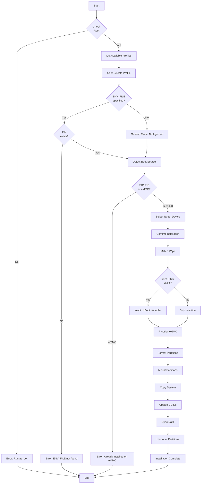

# Armbian Installer for AMLogic TV Boxes

[](https://opensource.org/licenses/MIT)
[](https://www.gnu.org/software/bash/)
[](https://www.armbian.com/)
[](https://en.wikipedia.org/wiki/Amlogic)

> **Language / Idioma:** **[🟢 English]** | [Português](README.md)

Automated installer to transfer **Armbian** from USB/SD to eMMC on AMLogic TV Boxes, with special support for locked bootloader devices. Specifically developed for Armbian, but adaptable to other ARM Linux distributions with technical knowledge.

**Author:** [Pedro Rigolin](https://github.com/pedrohrigolin)

**Project:** Developed for the [TVBox Project](https://github.com/projetotvbox) at **Federal Institute of São Paulo (IFSP)**, Salto Campus

---

## 📑 Table of Contents

- [📦 About the TVBox Project](#-about-the-tvbox-project)
- [🔍 Overview](#-overview)
  - [🎯 Context and Motivation](#-context-and-motivation)
  - [📋 Expected Boot Device Structure](#-expected-boot-device-structure)
  - [🔧 Compatibility and Adaptability](#-compatibility-and-adaptability)
- [✨ Features](#-features)
- [🚀 Initial Preparation](#-initial-preparation)
- [💾 System Installation](#-system-installation)
- [📱 Usage](#-usage)
  - [Installation Flow](#installation-flow)
  - [Operation Modes](#operation-modes)
- [🔧 Technical Details](#-technical-details)
  - [Dependencies](#dependencies)
  - [Project Architecture](#project-architecture)
  - [Partition Layout](#partition-layout)
  - [Detailed Internal Flow](#detailed-internal-flow)
- [🔬 U-Boot Variables Extraction](#-u-boot-variables-extraction-hardcore-mode)
  - [🎯 Philosophy: "Each Box is a Universe"](#-philosophy-each-box-is-a-universe)
  - [⚠️ Mandatory Prerequisites](#️-mandatory-prerequisites)
  - [Method 1: Wipe & Auto-Regeneration](#method-1-wipe--auto-regeneration-example-htv-h8)
  - [Method 2: Ampart Analysis](#method-2-ampart-analysis-example-btv-e10-atv-a5)
  - [🔧 Offset Conversion](#-offset-conversion-quick-reference)
- [➕ Adding New Devices](#-adding-new-devices)
- [📋 Logs and Debug](#-logs-and-debug)
- [💡 Technical Notes and Advanced Tips](#-technical-notes-and-advanced-tips)
- [🔧 Troubleshooting](#-troubleshooting)
- [🙏 Credits](#-credits)
- [📄 License](#-license)
- [⚠️ Legal Disclaimer](#️-legal-disclaimer)

---

## 📦 About the TVBox Project

This installer was developed as part of the **TVBox Project at IFSP Salto Campus**, an initiative aimed at giving new purpose to TV Box devices seized by the Federal Revenue Service.

The project decharacterizes this equipment, transforming them into **functional mini PCs** with Linux, providing:
- Hardware reuse that would otherwise be discarded
- Digital inclusion through donations to communities
- Reduced environmental impact (e-waste)
- Technical training for students

This code was specifically developed to automate Armbian installation on AMLogic devices (S905X/X2/X3), facilitating large-scale reconfiguration processes.

---

## 🔍 Overview

### 🎯 Context and Motivation

**Standard Armbian** uses a **single ext4 partition**, but many AMLogic devices (especially TV Boxes with S905X/X2/X3/X4 SoCs) require **dual partitioning** to work correctly:

```
Partition 1: BOOT (FAT32) → Kernel, DTB, boot scripts
Partition 2: ROOTFS (ext4) → Root file system
```

**The Problem:**  
When the Armbian system is converted to this 2-partition structure (required for these devices), the **official Armbian installer** (`armbian-install`) **stops working**, as it was designed exclusively for single ext4 partitions.

**The Solution:**  
This installer **restores automation** for system transfer to internal eMMC, specifically adapted for the dual partition structure required by AMLogic TV Boxes. Additionally, it offers:

- ✅ **Automated installation** of dual-partition Armbian to eMMC
- ✅ **U-Boot variable injection** ([why?](#assets-u-boot-environment)) for locked devices
- ✅ **Interactive interface** (TUI) for device and profile selection
- ✅ **Device-specific profile support** (custom offsets)

### 📋 Expected Boot Device Structure

The installer assumes the current system is running from a USB/SD card with the following structure:

```
Partition 1: BOOT (FAT32, up to 512MB)
Partition 2: ROOTFS (ext4, remaining space)
```

### 🔧 Compatibility and Adaptability

**This installer was specifically developed for Armbian**, optimized for its boot structure and configuration files (`armbianEnv.txt`, DTBs, etc.).

#### Supported Devices

| Device | SoC | Profile | Status | Notes |
|--------|-----|---------|--------|-------|
| **HTV H8** | AMLogic S905X4 | `htv_h8.conf` | ✅ Tested | 128 MB offset, regenerated variables |
| **BTV E10** | AMLogic S905X3 | `btv_e10.conf` | ✅ Tested | 136 MB offset, preserved Amlogic structure |
| **ATV A5** | AMLogic S905X3 | `atv_a5.conf` | ✅ Tested | 136 MB offset, preserved Amlogic structure |
| **Generic** | AMLogic S905X/X2/X3/X4 | No profile | ⚠️ Experimental | Default 128 MB offset, **no U-Boot variable injection** |

**About generic installation:**
- ⚠️ Only works for devices with **unlocked bootloader**
- ⚠️ Does not inject custom U-Boot variables
- ⚠️ May result in black screen if bootloader cannot find kernel
- ✅ Useful for initial testing on new devices
- 💡 Recommended: Extract U-Boot variables and create custom profile

#### Adaptation for Other Distributions

**Can it be adapted to other Linux distributions?**

✅ **Yes**, as long as the distribution follows the same partition structure (BOOT FAT32 + ROOTFS ext4). Examples:
- Debian with similar partitioning
- Ubuntu for ARM
- Other Debian/Ubuntu-based distros

⚠️ **However, requires technical knowledge**:
- Understanding of U-Boot and boot scripts
- Modification of paths and configuration files in code
- Adjustment of Armbian-specific checks
- Extensive testing to ensure correct boot

**Recommendation:** If you don't have experience with ARM bootloaders and advanced shell scripting, use the installer **only with Armbian** as designed.

---

## ✨ Features

- ✅ **Interactive interface** with dialog menus
- ✅ **Automatic detection** of available eMMC disks
- ✅ **Device-specific profiles** (ATV A5, BTV E10, HTV H8)
- ✅ **U-Boot variable injection** ([why?](#assets-u-boot-environment)) for locked devices
- ✅ **Detailed logging** for debugging (`/tmp/armbian-install-amlogic.log`)
- ✅ **Automatic cleanup system** (unmounts on error/interruption)
- ✅ **Dependency checking** with automatic installation
- ✅ **Single instance lock** (prevents simultaneous executions)
- ✅ **Customizable partitioning** per device profile

---

## 🚀 Initial Preparation

### ⚠️ Asset Decompression (MANDATORY)

U-Boot variable files (`*.img`) are **gzip compressed** in the repository due to GitHub's size limit (100MB). Before using the installer for the first time, you **MUST** decompress them.

#### Why are files compressed?

The `.img` files contain binary images of U-Boot variables extracted from real devices. These files have tens of megabytes and, when compressed, drastically reduce in size (typically 90%+), allowing them to be versioned in Git.

#### How to decompress:

**Recommended Method (Decompress all assets):**

```bash
cd armbian-install-amlogic/assets/
gunzip -k *.img.gz
cd ../..
```

The `-k` flag keeps the original `.gz` files intact.

**Alternative Method (Decompress specific asset):**

```bash
# Example: only for ATV A5
gunzip -k armbian-install-amlogic/assets/uboot_envs_atv_a5.img.gz
```

#### Verification

After decompressing, confirm that `.img` files exist:

```bash
ls -lh armbian-install-amlogic/assets/*.img
```

You should see files like:
- `uboot_envs_atv_a5.img`
- `uboot_envs_btv_e10.img`
- `uboot_envs_htv_h8.img`

**Without this step, the installer will fail** when trying to inject U-Boot variables, resulting in an error during installation.

---

## 💾 System Installation

> **📍 Important Context:** The commands below should be executed **on the Armbian system running from USB/SD card**. The installer needs to be available on the removable system before using it to transfer Armbian to the device's internal eMMC.

To permanently install the script on the Armbian system from USB/SD, follow the steps below:

### 1. Decompress Assets

If you haven't decompressed the assets yet, see the **[Initial Preparation](#initial-preparation)** section for detailed instructions.

```bash
cd armbian-install-amlogic/assets/ && gunzip -k *.img.gz && cd ../..
```

### 2. Copy Main Script to Armbian System

```bash
# Copy script to /usr/bin of Armbian system (USB/SD)
sudo cp armbian-install-amlogic.sh /usr/bin/armbian-install-amlogic
sudo chmod +x /usr/bin/armbian-install-amlogic
```

### 3. Copy Configurations and Assets to Armbian System

```bash
# Copy profiles and assets to /etc of Armbian system (USB/SD)
sudo cp -r armbian-install-amlogic /etc/
```

### 4. Set Correct Permissions

```bash
# Permissions for directories (755) and files (644)
sudo chmod -R 755 /etc/armbian-install-amlogic
sudo find /etc/armbian-install-amlogic -type f -exec chmod 644 {} \;
```

**Permission explanation:**
- `755` for directories: Allows navigation and listing
- `644` for files: Read for all, write only for root

### 5. Run Installer

After installation on Armbian system from USB/SD, run the installer to transfer the system to eMMC:

```bash
sudo armbian-install-amlogic
```

---

## 📱 Usage

The installer presents an interactive interface (TUI) that will guide you through the process:

### Installation Flow

1. **Target eMMC disk selection**
   - Automatically detects available disks
   - Excludes current system disk

2. **Device profile selection**
   - Lists available profiles (ATV A5, BTV E10, HTV H8)
   - "Generic" option for unlisted devices

3. **Safety confirmations**
   - Data erasure warnings
   - Correct device confirmation

4. **Automatic installation**
   - Disk wipe
   - U-Boot variable injection (if applicable)
   - Partitioning and formatting
   - Data copy
   - Boot configuration

### Operation Modes

#### 1. Profile Installation (Recommended)

Select the profile corresponding to your device. The installer will:
- ✅ Load specific configurations
- ✅ Inject U-Boot variables (if needed)
- ✅ Apply correct partition offsets
- ✅ Maximize successful boot chances

**Supported devices:**
- ATV A5 (S905X3)
- BTV E10 (S905X2)
- HTV H8 (S905X4)

#### 2. Generic Installation (Advanced)

For devices with unlocked bootloader or unlisted:
- ⚠️ **Does not inject** U-Boot variables
- ⚠️ Uses conservative offset (128MB / sector 262144)
- ⚠️ May result in black screen on locked devices
- ℹ️ Use only if you know what you're doing

**When to use:**
- Device has unlocked bootloader
- You're sure you don't need custom variables
- Testing a new model

---

## 🔧 Technical Details

### Dependencies

The script automatically checks and installs the following dependencies:

- `pv` - Progress viewer for disk operations
- `dialog` - TUI interface for interactive menus
- `dosfstools` - FAT32 filesystem tools (mkfs.vfat)
- `rsync` - Efficient file synchronization

### Project Architecture

```
armbian-install-amlogic-project/
├── armbian-install-amlogic.sh      # Main installer script
└── armbian-install-amlogic/
    ├── assets/                     # U-Boot variables (binary .img files)
    │   ├── uboot_envs_atv_a5.img.gz
    │   ├── uboot_envs_btv_e10.img.gz
    │   └── uboot_envs_htv_h8.img.gz
    └── profiles/                   # Device-specific configurations
        ├── atv_a5.conf
        ├── btv_e10.conf
        └── htv_h8.conf
```

#### Assets (U-Boot Environment)

The `.img` files in `assets/` contain pre-configured U-Boot environment variables. These binaries are injected directly into eMMC at specific offsets, instructing the bootloader where to find the Linux kernel.

**Why is this necessary?**

The factory bootloader from **Amlogic** typically comes with **restrictive** U-Boot variables, only allowing boot on specific systems for which they were originally configured.

**The problem:**

1. **TV Box manufacturers** modify these variables to be **more permissive**, facilitating:
   - Boot on multiple operating systems
   - Recovery processes
   - Greater firmware flexibility

2. **During eMMC wipe/zeroing**, these permissive variables customized by manufacturers are **erased**

3. **After installation**, the bootloader reverts to Amlogic's restrictive factory settings

4. **Result:** The installed Armbian system **cannot boot**, even though it's correctly installed

**The solution (Assets):**

The `.img` files in assets **preserve and reinject** the manufacturer's permissive variables after installation, ensuring that:
- Armbian boots correctly from eMMC
- Boot scripts (`s905_autoscript`, `emmc_autoscript`) are found
- Alternative boot via SD/USB continues working
- System has the same flexibility as original Android/firmware

**When are assets NOT needed?**

If your device has **unlocked or factory-permissive bootloader** (not customized by manufacturer), you can safely use **generic installation** without U-Boot variable injection. In this case:
- Bootloader already searches for kernels on multiple media (SD/USB/eMMC)
- No custom variables that will be lost during wipe
- Installation will work normally without assets

#### Profiles (Device Configuration)

Each `.conf` file contains:

| Field | Description |
|-------|-------------|
| `BOARD_NAME` | Human-readable device name (e.g., "ATV A5 (S905X3)") |
| `AUTHOR` | Profile author |
| `ENV_OFFSET` | Sector where to inject U-Boot variables (usually 0) |
| `ENV_FILE` | Path to variables `.img` file |
| `LINUX_START_SECTOR` | First partition start sector (device-customized) |

### Partition Layout

#### Default Configuration

```
eMMC Layout:
┌─────────────────────┬──────────────────┬───────────────────────┐
│  Reserved Area      │  BOOT (FAT32)    │   ROOTFS (ext4)       │
│  (varies by profile)│  (512MB)         │   (remaining)         │
│  Start → Offset     │  Offset+         │   Calculated          │
└─────────────────────┴──────────────────┴───────────────────────┘
```

- **Reserved Area**: Initial region reserved for injected U-Boot variables (size varies by device)
- **BOOT Partition**: 512MB FAT32, contains kernel, DTB, boot scripts
- **ROOTFS Partition**: ext4, occupies all remaining space

#### Profile Customization

Each device defines its own `LINUX_START_SECTOR` (where BOOT partition starts):

| Profile | LINUX_START_SECTOR | Reserved Size | Extraction Method |
|---------|-------------------|---------------|-------------------|
| HTV H8 | 262144 | 128 MB | Method 1 (Regeneration) |
| BTV E10 | 278528 | 136 MB | Method 2 (Ampart) |
| ATV A5 | 278528 | 136 MB | Method 2 (Ampart) |

The correct offset is determined during the U-Boot variables extraction process (see [U-Boot Variables Extraction](#u-boot-variables-extraction-hardcore-mode)).

#### Safe Partitioning Offset

The installer uses a **profile-customized initial offset** to ensure Linux partitions don't overwrite injected U-Boot variables.

**Examples of used offsets:**

| Device | Offset (sectors) | Size (MB) | Method / Reason |
|--------|------------------|-----------|-----------------|
| **HTV H8** | 262144 | 128 MB | Method 1 - Regenerated variables, conservative offset |
| **BTV E10** | 278528 | 136 MB | Method 2 - Amlogic structure preserved via ampart |
| **ATV A5** | 278528 | 136 MB | Method 2 - Amlogic structure preserved via ampart |
| **Generic** | 262144 | 128 MB | No profile - Conservative margin |

**Why is offset necessary?**
- Leave space for injected U-Boot variables
- Avoid conflict with residual Android structures
- Ensure proper alignment for eMMC performance
- Accommodate different AMLogic device layouts

**Golden Rule:** Each profile defines its `LINUX_START_SECTOR` based on extraction method used (Method 1 or 2). The installer **never** starts Linux partitions before this safe position.

### Detailed Internal Flow

This diagram shows the internal execution flow of the installer, including all verification, partitioning, and variable injection steps:



> **Note for Developers**: 
> - **Profile validation**: The installer only validates if the specified `ENV_FILE` exists at the configured path. If file doesn't exist, aborts with error.
> - **Variable injection**: U-Boot variables are injected at offset defined in `ENV_OFFSET` (varies by device: 0, 237568, etc.) using `dd` with `seek`.
> - **Generic Mode**: If `ENV_FILE` and `ENV_OFFSET` are not defined in profile, installer automatically disables injection but continues installation.

### Disk Operations

```bash
# Complete wipe
dd if=/dev/zero | pv | dd of=/dev/mmcblkX bs=1M oflag=direct

# Partition creation (fdisk)
- MBR partition table
- P1: Bootable, Type 0xC (W95 FAT32 LBA), 512MB
- P2: Type 0x83 (Linux), remaining

# Formatting
mkfs.vfat -F 32 -n BOOT /dev/mmcblkXp1
mkfs.ext4 -F -q -L ROOTFS /dev/mmcblkXp2
```

### Data Copy

**BOOT Partition:**
```bash
cp -rL /mnt/src_boot/* /mnt/tgt_boot/
```

**ROOTFS Partition:**
```bash
rsync -aAXv --delete \
  --exclude={"/dev/*","/proc/*","/sys/*","/tmp/*","/run/*","/mnt/*","/media/*","/lost+found"} \
  /mnt/src_root/ /mnt/tgt_root/
```

### U-Boot Variable Injection

```bash
dd if=uboot_envs_device.img of=/dev/mmcblkX bs=512 seek=$ENV_OFFSET conv=notrunc
```

Writes variables directly to specified offset (usually sector 0).

### Configuration Updates

1. **armbianEnv.txt**: Updates `rootdev=UUID=xxxx` with new UUID
   - If file already exists: only updates root UUID
   - If doesn't exist: creates from scratch and requests DTB selection
2. **fstab**: Updates BOOT and ROOTFS entries with new UUIDs
3. **DTB Selection** (only if armbianEnv.txt doesn't exist): Interactive menu to select correct Device Tree Blob for hardware

---

## 🔬 U-Boot Variables Extraction (Hardcore Mode)

This section is intended for **developers and advanced enthusiasts** who want to add support for new devices. The process requires hardware knowledge and serial interface.

### 🎯 Philosophy: "Each Box is a Universe"

Unlike standard PCs, **each TV Box model** can have completely different bootloader architecture:

- **HTV H8:** Bootloader auto-regenerates variables after wipe → Method 1
- **BTV E10 / ATV A5:** Rigid bootloader, requires structure preservation → Method 2
- **Your device:** Could be any of the above cases

**There is no silver bullet.** There is diagnosis, testing, and adaptation. The methods below are **reverse engineering tools**, not fixed recipes.

### ⚠️ Mandatory Prerequisites

1. **Functional Linux ARM system** running from USB/SD on target AMLogic device
   - Can be Armbian, Debian, Ubuntu ARM, etc.
   - Required to access internal eMMC and execute analysis/extraction commands
   - System needs to boot correctly for shell access
   
2. **TTL Serial Adapter (UART)** of good quality (3.3V, **NEVER 5V!**)
3. Soldering skills to access TX/RX/GND on board
4. Serial terminal software (PuTTY, Minicom, picocom)
5. **Patience and methodology**

> **🔴 Attention:** UART serial interface is **mandatory for BOTH extraction methods** presented in this section. There's no way to properly extract and configure U-Boot variables without serial bootloader access.

**Typical Serial Configuration:**
- Baud Rate: **115200** (Amlogic standard) or **1500000** (some models)
- Data Bits: 8
- Stop Bits: 1  
- Parity: None
- Flow Control: None

```bash
# Example with picocom
picocom -b 115200 /dev/ttyUSB0

# If nothing appears, try alternative baud rate
picocom -b 1500000 /dev/ttyUSB0
```

### 🔒 Golden Rule: ALWAYS BACKUP!

Before any experiment, make complete eMMC backup:

```bash
# Bit-by-bit backup with compression (saves space on USB)
sudo dd if=/dev/mmcblkX bs=1M status=progress | gzip -c > backup_emmc_full.img.gz

# To restore in case of disaster:
# gunzip -c backup_emmc_full.img.gz | sudo dd of=/dev/mmcblkX bs=1M status=progress
```

**Why gzip?** A 16GB backup becomes ~2-4GB compressed, saving much space.

---

### Method 1: "Wipe & Auto-Regeneration" (Example: HTV H8)

This method works on devices where the **factory bootloader** (usually in SPI Flash or protected partitions) can recreate its environment variables at a favorable offset after total wipe.

#### Step 1: Total Wipe

After backup, completely destroy eMMC structure:

```bash
# Zero ENTIRE eMMC (no mercy)
sudo dd if=/dev/zero of=/dev/mmcblkX bs=1M status=progress conv=fsync
```

#### Step 2: Serial Interception

1. **Power off** the box from outlet
2. **Connect** serial interface to TX/RX/GND pins
3. **Open** serial terminal on PC (e.g., `picocom -b 115200 /dev/ttyUSB0`)
4. **Power on** box and repeatedly press **Enter** or **Space**
5. You'll drop into U-Boot prompt (e.g., `sc2_ah212=>` or `=>`)

#### Step 3: Variable Configuration

Execute the following commands **one at a time** in U-Boot prompt:

```text
setenv start_autoscript 'if mmcinfo; then run start_mmc_autoscript; fi; if usb start; then run start_usb_autoscript; fi; run start_emmc_autoscript'
setenv start_emmc_autoscript 'if fatload mmc 1 1020000 emmc_autoscript; then setenv devtype "mmc"; setenv devnum 1; autoscr 1020000; fi;'
setenv start_mmc_autoscript 'if fatload mmc 0 1020000 s905_autoscript; then setenv devtype "mmc"; setenv devnum 0; autoscr 1020000; fi;'
setenv start_usb_autoscript 'for usbdev in 0 1 2 3; do if fatload usb ${usbdev} 1020000 s905_autoscript; then setenv devtype "usb"; setenv devnum 0; autoscr 1020000; fi; done'
setenv bootcmd 'run start_autoscript'
setenv bootdelay 1
```

Save and reboot:

```text
saveenv
reset
```

> **💡 Important Tip:** These variables configured above (`start_autoscript`, `start_emmc_autoscript`, etc.) are **highly recommended for both methods** (Method 1 and Method 2). They ensure the bootloader searches for boot scripts on different media (eMMC, SD/USB) in correct order, allowing Armbian to start properly.

#### Step 4: Persistence Test

After reboot, **intercept U-Boot again** and verify:

```text
printenv
```

**Result analysis:**

- ✅ **Variables present?** Board passed the test! Continue to Step 5.
- ❌ **Variables disappeared?** Bootloader doesn't regenerate reliably. Skip to **Method 2 (Ampart)**.

#### Step 5: Boot from USB and Analysis

Connect USB with Armbian and let boot proceed. After system starts:

**Diagnostic Logic:**  
Since we formatted entire eMMC with zeros (`0x00`), **any non-zero data** is something U-Boot wrote when executing `saveenv`.

```bash
# Search for "bootcmd=" string in first 138MB
sudo hexdump -C -n 144703488 /dev/mmcblkX | grep -C 5 "bootcmd="
```

**Example output (HTV H8):**

```
07400000  00 00 00 00 62 6f 6f 74  63 6d 64 3d 72 75 6e 20  |....bootcmd=run |
07400010  73 74 61 72 74 5f 61 75  74 6f 73 63 72 69 70 74  |start_autoscript|
```

Note first column: `07400000` (hexadecimal) = **116 MB** in decimal.

#### Step 6: Precise Cut Calculation

**⚠️ IMPORTANT:** Don't copy from byte 0! Extract **only U-Boot variables region**, using `skip` to jump to identified offset.

**Calculation based on example (HTV H8):**

1. **Variables start offset:** 116 MB (0x07400000 from hexdump)
2. **Size to extract:** 8 MB (typical safe for U-Boot variables)

```bash
# Extract ONLY variables region (116MB to 116MB+8MB)
sudo dd if=/dev/mmcblkX of=uboot_envs_htv_h8.img bs=1M skip=116 count=8 status=progress
```

**Parameter explanation:**
- `skip=116`: Skip first 116 MB (offset where variables start)
- `count=8`: Extract only 8 MB from this point
- **Result:** 8 MB file containing exactly U-Boot variables

**Note for profile:**

**1. Calculate ENV_OFFSET (in sectors):**

```bash
# Formula: MB × 2048 = sectors
# Example HTV H8: 116 MB of variables
echo $((116 * 2048))  # Result: 237568 sectors
```

- `ENV_OFFSET` = **237568** sectors
  - **Why?** Installer uses `dd` with `seek=$ENV_OFFSET` to inject `.img` file at correct position on target eMMC
  - **Conversion:** 116 MB × 2048 = 237568 sectors (1 sector = 512 bytes)

**2. Calculate LINUX_START_SECTOR:**

**📊 Conditional Rule:**

```bash
# Base formula: offset_mb + header_size_mb + 4 (margin)
# If result < 128 MB → use 128 MB (safe minimum)
# If result ≥ 128 MB → use exact calculation

# Example HTV H8:
# offset_mb=116, header_size=8, margin=4
# Calculation: 116 + 8 + 4 = 128 MB
# Since 128 >= 128 → use 128 MB

echo $((128 * 2048))  # Result: 262144 sectors
```

**Conditional example (if calculation gives < 128 MB):**

```bash
# Assuming offset_mb=50, header_size=8, margin=4
# Calculation: 50 + 8 + 4 = 62 MB
# Since 62 < 128 → use 128 MB (minimum standard)

echo $((128 * 2048))  # Result: 262144 sectors
```

**Conditional example (if calculation gives > 128 MB):**

```bash
# Assuming offset_mb=120, header_size=10, margin=4
# Calculation: 120 + 10 + 4 = 134 MB
# Since 134 > 128 → use 134 MB (exact calculation)

echo $((134 * 2048))  # Result: 274432 sectors
```

- `LINUX_START_SECTOR` = **262144** sectors (128 MB) → HTV H8 case
  - **Why 128 MB minimum?** Ensures sufficient space for bootloader structures and U-Boot variables
  - **4 MB margin:** Additional safety against fragmentation/alignment
  - **Logic:** `max(128 MB, offset_mb + header_size + 4)`

---

### Method 2: "Ampart Analysis" (Example: BTV E10, ATV A5)

This method is necessary when device **doesn't regenerate** environment variables reliably after total wipe.

> **⚠️ Requirement:** Like Method 1, this method **also requires UART serial interface** to intercept U-Boot and apply recommended variables from Step 3. The difference is in file extraction strategy.

#### Ampart Installation

The `ampart` tool is specific to Amlogic devices and doesn't come pre-installed:

```bash
# Clone repository
git clone https://github.com/7Ji/ampart.git
cd ampart

# Compile and install
make
sudo make install

# Verify installation
ampart --help
```

**Source:** [7Ji/ampart](https://github.com/7Ji/ampart)

#### Step 1: Preparation

If tried Method 1 and failed, restore original backup:

```bash
gunzip -c backup_emmc_full.img.gz | sudo dd of=/dev/mmcblkX bs=1M status=progress
```

#### Step 2: Run Ampart Simulation

With **original** system (or restored backup) running:

```bash
# Simulate partition table reorganization
sudo ampart /dev/mmcblkX --mode dclone data::-1:4
```

#### Step 3: Detailed Report Analysis

Ampart will display an **EPT** (Extended Partition Table) table. Look for `env` and `data` lines:

**Example output:**

```
EPT report: 5 partitions in the table
 0: bootloader    0 (   0.00M)        400000 (   4.00M)
 1: reserved  400000 (   4.00M)       4000000 (  64.00M)
 2: cache    4400000 (  68.00M)        800000 (   8.00M)
 3: env      7400000 ( 116.00M)        800000 (   8.00M)
 4: data     8400000 ( 132.00M)     39ba00000 (  14.43G)
```

**Critical Interpretation:**

| Partition | Offset | Size | Meaning |
|-----------|--------|------|---------|
| `bootloader` | 0 MB | 4 MB | Primary bootloader |
| `reserved` | 4 MB | 64 MB | Reserved area (DTB, etc.) |
| `cache` | 68 MB | 8 MB | Cache (usually ignored) |
| **`env`** | **116 MB** | **8 MB** | **U-Boot Variables (CRITICAL!)** |
| **`data`** | **132 MB** | remaining | **Free space start** |

**Extraction Rule:**  
Extract from byte 0 to **`data` partition start** (132 MB in example).

```bash
# Extract exactly first 132 MB (per ampart report)
sudo dd if=/dev/mmcblkX of=uboot_envs_btv_e10.img bs=1M count=132 status=progress
```

**Note for profile:**

**1. Calculate ENV_OFFSET:**

- `ENV_OFFSET` = **0** (zero)
  - **Why?** In Method 2, we extract **from byte 0** (including bootloader, reserved, cache, env)
  - During installation, `dd` injects entire file from eMMC start
  - U-Boot variables are already at correct position inside extracted file

**2. Calculate LINUX_START_SECTOR:**

**📊 Conditional Rule:**

```bash
# Base formula: data_start_mb + 4 (margin)
# If result < 128 MB → use 128 MB (safe minimum)
# If result ≥ 128 MB → use exact calculation

# Example BTV E10:
# data_start=132 MB (from ampart report), margin=4
# Calculation: 132 + 4 = 136 MB
# Since 136 > 128 → use 136 MB (exact calculation)

echo $((136 * 2048))  # Result: 278528 sectors
```

**Conditional example (if calculation gives < 128 MB):**

```bash
# Assuming data_start=100 MB, margin=4
# Calculation: 100 + 4 = 104 MB
# Since 104 < 128 → use 128 MB (minimum standard)

echo $((128 * 2048))  # Result: 262144 sectors
```

- `LINUX_START_SECTOR` = **278528** sectors (136 MB) → BTV E10 case
  - **Why 128 MB minimum?** Ensures sufficient space for preserved Android/Amlogic structures
  - **Logic:** `max(128 MB, data_start_mb + 4)`
  - **Conversion:** 136 MB × 2048 = 278528 sectors

#### Step 4: Validation

To ensure correct capture:

```bash
# Check if "bootcmd" exists in extracted file
strings uboot_envs_btv_e10.img | grep -i "bootcmd"
```

If you find strings like `bootcmd=`, `start_autoscript`, etc., extraction was successful!

> **💡 Important Recommendation:** Before finalizing extraction, it's **highly recommended** to access U-Boot via serial UART and configure variables from **Step 3: Variable Configuration** (Method 1 section). After applying these variables (`setenv start_autoscript`, `saveenv`, etc.), extract again with `dd` to ensure `.img` file contains optimized boot configurations. This ensures better compatibility and boot on different media (SD/USB/eMMC).

---

### 📊 Method Comparison

| Aspect | Method 1 (Wipe & Regen) | Method 2 (Ampart) |
|--------|-------------------------|-------------------|
| Complexity | Medium | High |
| Resulting File | Clean (only zeros + env) | Dirty (Android remnants) |
| Typical Size | 32-64 MB | 132 MB |
| Requires Serial UART | ✅ Mandatory | ✅ Mandatory |
| Example | HTV H8 | BTV E10, ATV A5 |

> **⚠️ Important:** Both methods require UART serial interface to intercept U-Boot and configure boot variables. The difference is in variable file extraction strategy.

---

### 🔧 Offset Conversion (Quick Reference)

This section is **critical** for correctly configuring `ENV_OFFSET` and `LINUX_START_SECTOR` values in device profiles.

#### Fundamentals

- **1 sector = 512 bytes**
- **1 MB = 1024 × 1024 bytes = 1048576 bytes**
- **1 MB = 2048 sectors** (simplified formula: MB × 2048)

#### Essential Conversions

**1. Hexadecimal (hexdump) → Decimal (bytes):**

```bash
# Example: 0x07400000 from hexdump
echo $((0x07400000))  # Result: 121634816 bytes
```

**2. Bytes → Megabytes:**

```bash
# Divide by 1024 twice (or 1048576)
echo $((121634816 / 1024 / 1024))  # Result: 116 MB
```

**3. Megabytes → Sectors (MOST IMPORTANT!):**

```bash
# Simplified formula: MB × 2048
echo $((116 * 2048))  # Result: 237568 sectors

# Complete formula (MB × 1024 × 1024 / 512):
echo $((116 * 1024 * 1024 / 512))  # Result: 237568 sectors
```

**4. Sectors → Megabytes (reverse verification):**

```bash
# Divide by 2048
echo $((237568 / 2048))  # Result: 116 MB
```

#### Practical Examples

**Example 1: HTV H8 (Method 1)**

```bash
# Hexdump shows: 07400000
# Step 1: Hex → Decimal
echo $((0x07400000))  # = 121634816 bytes

# Step 2: Bytes → MB
echo $((121634816 / 1024 / 1024))  # = 116 MB

# Step 3: MB → Sectors (ENV_OFFSET)
echo $((116 * 2048))  # = 237568 sectors ✅

# Step 4: LINUX_START_SECTOR (116 + 8 extracted + 4 margin = 128 MB)
echo $((128 * 2048))  # = 262144 sectors ✅
```

**Result:**
- `ENV_OFFSET=237568`
- `LINUX_START_SECTOR=262144`

**Example 2: BTV E10 (Method 2 - Ampart)**

```bash
# Ampart report shows 'data' partition at 132 MB
# ENV_OFFSET = 0 (we extract from beginning)

# LINUX_START_SECTOR: data (132 MB) + margin (4 MB) = 136 MB
echo $((136 * 2048))  # = 278528 sectors ✅
```

**Result:**
- `ENV_OFFSET=0`
- `LINUX_START_SECTOR=278528`

#### Terminal Shortcut

Save this alias in your `~/.bashrc` for quick conversion:

```bash
# Add to ~/.bashrc
alias mb2sec='echo "MB → Sectors Conversion:"; read -p "Enter MB: " mb; echo "$((mb * 2048)) sectors"'
alias hex2mb='echo "Hex → MB Conversion:"; read -p "Enter hex (e.g., 0x07400000): " hex; echo "$((hex / 1024 / 1024)) MB"'

# Reload bashrc
source ~/.bashrc

# Usage:
mb2sec  # Enter 116 → Result: 237568 sectors
hex2mb  # Enter 0x07400000 → Result: 116 MB
```

#### 🎯 Critical Rule: LINUX_START_SECTOR Minimum

**This is the most important rule to ensure device boots correctly:**

```bash
# Rule: LINUX_START_SECTOR = max(128 MB, base_calculation)
# Where base_calculation varies by method:

# Method 1: offset_mb + header_size_mb + 4
# Method 2: data_start_mb + 4

# Examples:
# If base_calculation = 62 MB  → use 128 MB (262144 sectors)
# If base_calculation = 128 MB → use 128 MB (262144 sectors)
# If base_calculation = 136 MB → use 136 MB (278528 sectors)
```

**Why is 128 MB the absolute minimum?**

- Ensures sufficient space for bootloader, reserved partitions, and U-Boot variables
- Avoids conflicts with residual structures from original Android system
- Provides safety margin against fragmentation and sector misalignment
- Compatibility with most AMLogic S905X/X2/X3/X4 devices

**⚠️ NEVER use values less than 262144 sectors (128 MB) for LINUX_START_SECTOR!**

---

## ➕ Adding New Devices

After extracting variables using one of the methods above:

### 1. Prepare Assets

Copy and **compress** extracted `.img` file to assets directory:

```bash
# Copy file to assets directory
cp uboot_envs_mydevice.img armbian-install-amlogic/assets/

# Compress with maximum compression (IMPORTANT for Git)
gzip -9 armbian-install-amlogic/assets/uboot_envs_mydevice.img
```

**Why compress?**  
`.img` files exceed GitHub's 100MB limit. Gzip compression drastically reduces size (typically >90%), allowing Git versioning. Users decompress before installing (see [Initial Preparation](#initial-preparation) section).

**Result:** You'll have `uboot_envs_mydevice.img.gz` ready for commit.

### 2. Create Profile

Create new configuration file in `armbian-install-amlogic/profiles/`:

#### Method 1 Example (Wipe & Regen - like HTV H8)

**Scenario:** Hexdump showed variables at `0x07400000`, we extracted 8 MB.

**Calculations:**

```bash
# ENV_OFFSET: convert hex offset to sectors
echo $((0x07400000 / 1024 / 1024))  # = 116 MB
echo $((116 * 2048))                 # = 237568 sectors ✅

# LINUX_START_SECTOR: apply conditional rule
# Base: offset + extracted_size + margin = 116 + 8 + 4 = 128 MB
# Rule: if < 128 MB → use 128 MB, else use calculation
# Since 128 >= 128 → use 128 MB
echo $((128 * 2048))                 # = 262144 sectors ✅
```

**File:** `armbian-install-amlogic/profiles/mydevice_method1.conf`

```properties
BOARD_NAME="My Device Method1 (S905X4)"
AUTHOR="Your Name"
ENV_OFFSET=237568
ENV_FILE="/etc/armbian-install-amlogic/assets/uboot_envs_mydevice.img"
LINUX_START_SECTOR=262144
```

#### Method 2 Example (Ampart - like BTV E10)

**Scenario:** Ampart showed `data` partition starting at 132 MB, we extracted from byte 0.

**Calculations:**

```bash
# ENV_OFFSET: Method 2 always uses 0 (extraction from start)
# ENV_OFFSET = 0 ✅

# LINUX_START_SECTOR: apply conditional rule
# Base: data_start + margin = 132 + 4 = 136 MB
# Rule: if < 128 MB → use 128 MB, else use calculation
# Since 136 > 128 → use 136 MB (exact calculation)
echo $((136 * 2048))  # = 278528 sectors ✅
```

**File:** `armbian-install-amlogic/profiles/mydevice_method2.conf`

```properties
BOARD_NAME="My Device Method2 (S905X3)"
AUTHOR="Your Name"
ENV_OFFSET=0
ENV_FILE="/etc/armbian-install-amlogic/assets/uboot_envs_mydevice.img"
LINUX_START_SECTOR=278528
```

#### Value Validation

**Before saving profile, validate:**

```bash
# 1. ENV_OFFSET must be integer number of sectors
# 2. LINUX_START_SECTOR must be greater than ENV_OFFSET (if ENV_OFFSET != 0)
# 3. LINUX_START_SECTOR minimum: 262144 (128 MB) - never less!
# 4. LINUX_START_SECTOR typical: 262144 (128 MB) or 278528 (136 MB)

# Verify conversion is correct (example 116 MB):
echo $((116 * 2048))      # Should return 237568
echo $((237568 / 2048))   # Should return 116 (reverse check)

# Validate conditional rule:
# If your calculation gave < 128 MB, ALWAYS use 128 MB (262144 sectors)
```

**⚠️ Critical values - errors here result in:**
- Partitions overwriting U-Boot variables → Device won't boot
- Incorrect offsets → Bootloader can't find variables → Black screen
- **LINUX_START_SECTOR < 128 MB → Insufficient space → Guaranteed failure**

### 3. Install on Armbian System

Copy main script and configurations to system:

```bash
# Copy script to /usr/bin of Armbian system (USB/SD)
sudo cp armbian-install-amlogic.sh /usr/bin/armbian-install-amlogic
sudo chmod +x /usr/bin/armbian-install-amlogic

# Copy profiles and assets to /etc of Armbian system (USB/SD)
sudo cp -r armbian-install-amlogic /etc/
```

### 4. Set Correct Permissions

```bash
# Permissions for directories (755) and files (644)
sudo chmod -R 755 /etc/armbian-install-amlogic
sudo find /etc/armbian-install-amlogic -type f -exec chmod 644 {} \;
```

**Permission explanation:**
- `755` for directories: Allows navigation and listing
- `644` for files: Read for all, write only for root

### 5. Test

Run installer and verify new profile appears in selection list:

```bash
sudo armbian-install-amlogic
```

If everything is correct, device name (`BOARD_NAME`) will appear in selection menu.

> **⚡ Mandatory Real Test:** Profile appearing in menu is not enough! Execute **complete installation** to eMMC and verify device actually boots correctly. Test:
> - Successful eMMC boot
> - Correct hardware detection
> - Connectivity (Ethernet/Wi-Fi)
> - General system functionality
> 
> Only consider profile functional after successful real boot!

### 6. Contribute!

If profile works perfectly, consider contributing to project:
- Open Pull Request with profile and **compressed asset (`.img.gz`)**
- Document device peculiarities
- Include photos of serial soldering points (if possible)

**⚠️ IMPORTANT for PRs:**  
- Always commit `.img.gz` files (compressed), NEVER `.img` (uncompressed)
- `.gitignore` is configured to accept only `.img.gz`
- Check file size before commit (should be <100MB)

---

## 📋 Logs and Debug

All logs are written to: `/tmp/armbian-install-amlogic.log`

Includes:
- Hardware detection
- Partition state
- Executed commands
- Exit codes
- Detailed error messages

For debugging, run script and check log after any failure.

---

## 💡 Technical Notes and Advanced Tips

### Race Conditions in eMMC

eMMC memories are slower than SSDs. Kernel takes time to create device files (`/dev/mmcblkXp1`) after partitioning operations. Installer implements active waiting:

```bash
partprobe /dev/mmcblkX   # Force table re-read
udevadm settle            # Wait for udev stabilization
sleep 2                   # Additional margin
```

On very slow devices, increase `sleep` to 5 seconds.

### Why Not Use `discard` on Cheap eMMC?

Many TV Box eMMCs don't properly support TRIM. Using `discard` flags in `mount` or `mkfs` can cause:
- I/O errors during formatting
- Silent data corruption
- Degraded performance

Installer **doesn't use** `discard` by default for maximum compatibility.

### Difference Between `dd` Direct vs Buffered

```bash
# Buffered (faster, but may not write immediately)
dd if=file.img of=/dev/mmcblkX bs=1M

# Direct (slower, but guarantees physical write)
dd if=file.img of=/dev/mmcblkX bs=1M oflag=direct conv=fsync
```

Installer uses `oflag=direct` on wipe to ensure zeros are actually written to eMMC, not just cache.

### Validating Extracted `.img` Files

Always validate if extracted variable file contains relevant data:

```bash
# Check size
ls -lh uboot_envs_device.img

# Search for recognizable strings
strings uboot_envs_device.img | grep -E "bootcmd|bootdelay|start_autoscript"

# View in hex (first 512 bytes)
hexdump -C uboot_envs_device.img | head -32
```

If file is empty or full of zeros, extraction failed.

---

## 🔧 Troubleshooting

### Black screen after installation

**Cause:** Incorrect U-Boot variables, wrong DTB, or inadequate partition offset.

**Solution:**
1. Verify you selected correct device profile
2. Confirm correct DTB for your SoC:
   - S905X: `meson-gxl-s905x-*.dtb`
   - S905X2: `meson-g12a-s905x2-*.dtb`
   - S905X3: `meson-sm1-s905x3-*.dtb`
3. **New device without profile?** Follow **U-Boot Variables Extraction** section to create custom profile

### Box doesn't boot from eMMC (returns to USB)

**Cause:** U-Boot variables not injected correctly or `.img` file is corrupted.

**Solution:**
1. Verify `ENV_FILE` exists at path specified in profile
2. Validate extracted file content:
   ```bash
   strings /etc/armbian-install-amlogic/assets/uboot_envs_device.img | grep -i "bootcmd"
   ```
3. If empty or without relevant data, redo extraction via Method 1 or 2

### Partition mount failure

**Cause:** Partitions not created correctly or race condition (Kernel hasn't created `/dev/mmcblkXp1` yet).

**Solution:** 

1. Check log in `/tmp/armbian-install-amlogic.log`
2. Installer already has race condition protections:
   ```bash
   partprobe /dev/mmcblkX
   udevadm settle
   sleep 2
   ```
3. On very slow eMMCs, may need to increase `sleep`

### U-Boot variables don't persist after `saveenv`

**Cause:** Bootloader lacks permission or space to write to eMMC, or environment region is corrupted.

**Symptoms:**
- Executes `saveenv` without errors
- After `reset` and `printenv`, variables disappeared

**Solution:**
1. **Try unlocking write:**
   ```text
   mmc dev 1
   mmc info
   ```
   Check if device is write-protected

2. **Use Method 2 (Ampart):** Device probably doesn't regenerate variables reliably. Restore backup and follow Ampart method to preserve original structure.

### System doesn't boot from eMMC

**Cause:** U-Boot still configured for SD/USB boot.

**Solution:** 
- Run installation again
- On locked devices, ensure using profile (not generic)

---

## 🙏 Credits

**This is an independent project**, developed from scratch with its own objectives and architecture.

### 🏛️ Institutional Recognition

Developed for **TVBox Project** at **Federal Institute of São Paulo (IFSP), Salto Campus**.

The TVBox Project is a social impact initiative that transforms TV Boxes seized by Federal Revenue Service into mini PCs with Linux, promoting:
- Sustainability through hardware reuse
- Digital inclusion in underserved communities
- Technical training for students
- E-waste reduction

### 📚 Technical References

During development, the following projects were studied as technical reference:

- **Studied for reference:** [ophub/amlogic-s9xxx-armbian](https://github.com/ophub/amlogic-s9xxx-armbian)
- **Conceptual inspiration:** [unifreq/openwrt_packit](https://github.com/unifreq/openwrt_packit)
- **Tool used (ampart):** [7Ji/ampart](https://github.com/7Ji/ampart)

---

## 📄 License

This project is licensed under the **MIT License**.

```
MIT License

Copyright (c) 2026 Pedro Rigolin

Developed for Projeto TVBox - Instituto Federal de São Paulo (IFSP), Campus Salto
```

See [LICENSE](LICENSE) file for more details.

MIT license allows free use (including commercial), modification and distribution, as long as original credits are maintained.

---

## ⚠️ Legal Disclaimer

⚠️ **USE AT YOUR OWN RISK**

This installer modifies device eMMC memory. Incorrect operations may result in:
- Total data loss
- Unbootable device ("brick")
- Warranty void

**Always backup** important data before using this installer.

**Compatibility:** This installer was developed and tested specifically for **Armbian**. Use with other Linux distributions has not been tested and may result in boot failures or system issues.

The author is not responsible for hardware damage or data loss.
