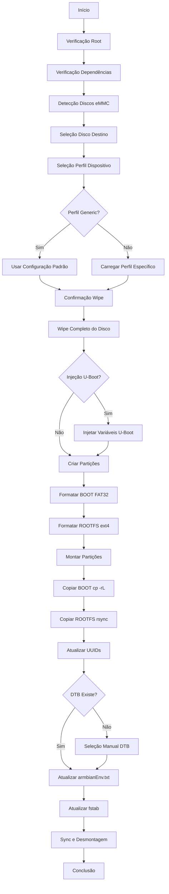

# Armbian Installer for AMLogic TV Boxes

Instalador automatizado de Armbian em dispositivos TV Box baseados em AMLogic, com suporte especial para dispositivos com bootloader locked.

**Autor:** Pedro Rigolin

---

## Visão Geral

Este instalador permite transferir um sistema Armbian rodando em pendrive/cartão SD para a memória eMMC interna de TV Boxes AMLogic (S905X, S905X2, S905X3, etc.). O processo é totalmente interativo via TUI (dialog) e inclui suporte para dispositivos que requerem injeção de variáveis do U-Boot.

### Estrutura Esperada do Dispositivo de Boot

O instalador assume que o sistema atual está rodando de um dispositivo removível com a seguinte estrutura:

```
Partição 1: BOOT (FAT32, até 512MB)
Partição 2: ROOTFS (ext4, restante do espaço)
```

---

## Características

- ✅ **Interface interativa** com menus dialog
- ✅ **Detecção automática** de discos eMMC disponíveis
- ✅ **Perfis específicos** por dispositivo (ATV A5, BTV E10, HTV H8)
- ✅ **Injeção de variáveis U-Boot** para dispositivos locked
- ✅ **Logging detalhado** para debug (`/tmp/armbian-install-amlogic.log`)
- ✅ **Sistema de cleanup automático** (desmonta em caso de erro/interrupção)
- ✅ **Verificação de dependências** com instalação automática
- ✅ **Lock de instância única** (previne execuções simultâneas)
- ✅ **Preservação do bootloader de fábrica** (primeiros 128MB)

---

## Dependências

O script verifica e instala automaticamente as seguintes dependências:

- `pv` - Visualizador de progresso para operações de disco
- `dialog` - Interface TUI para menus interativos
- `dosfstools` - Ferramentas para sistema de arquivos FAT32 (mkfs.vfat)
- `rsync` - Sincronização eficiente de arquivos

---

## Arquitetura do Projeto

```
armbian-install-amlogic-project/
├── armbian-install-amlogic.sh      # Script principal (versão customizada)
├── armbian-install-ophub.sh        # Script base (fork do Ophub)
└── armbian-install-amlogic/
    ├── assets/                     # Variáveis do U-Boot (binários .img)
    │   ├── uboot_envs_atv_a5.img
    │   ├── uboot_envs_btv_e10.img
    │   └── uboot_envs_htv_h8.img
    └── profiles/                   # Configurações por dispositivo
        ├── atv_a5.conf
        ├── btv_e10.conf
        └── htv_h8.conf
```

### Assets (U-Boot Environment)

Os arquivos `.img` em `assets/` contêm variáveis de ambiente do U-Boot pré-configuradas. Esses binários são injetados diretamente na eMMC em offsets específicos, instruindo o bootloader onde encontrar o kernel Linux.

**Por que isso é necessário?**  
Dispositivos com bootloader locked (HTV, BTV, ATV) não permitem modificação de variáveis do U-Boot via software. A injeção direta no offset correto garante que o bootloader carregue o sistema corretamente.

### Profiles (Configuração por Dispositivo)

Cada arquivo `.conf` contém:

| Campo | Descrição |
|-------|-----------|
| `BOARD_NAME` | Nome legível do dispositivo (ex: "ATV A5 (S905X3)") |
| `AUTHOR` | Autor do perfil |
| `ENV_OFFSET` | Setor onde injetar as variáveis do U-Boot (geralmente 0) |
| `ENV_FILE` | Caminho para o arquivo `.img` das variáveis |
| `LINUX_START_SECTOR` | Setor inicial da primeira partição (customizado por dispositivo) |

---

## Fluxo de Instalação



---

## Layout de Partições

### Configuração Padrão

```
eMMC Layout:
┌─────────────────────┬──────────────────┬───────────────────────┐
│  Bootloader Area    │  BOOT (FAT32)   │   ROOTFS (ext4)      │
│  (0 - 128MB)       │  (512MB)        │   (restante)         │
│  Setor 0-262143    │  Setor 262144+  │   Setor calculado    │
└─────────────────────┴──────────────────┴───────────────────────┘
```

- **Bootloader Area**: Primeiros 128MB (setores 0-262143) preservados para bootloader de fábrica
- **BOOT Partition**: 512MB FAT32, contém kernel, DTB, scripts de boot
- **ROOTFS Partition**: ext4, ocupa todo espaço restante

### Customização via Perfil

Dispositivos podem especificar `LINUX_START_SECTOR` diferente do padrão (262144). Exemplo: BTV E10 usa 278528.

---

## Uso

### Instalação Padrão

```bash
sudo ./armbian-install-amlogic.sh
```

O script guiará você por:
1. Seleção do disco eMMC de destino
2. Seleção do perfil do dispositivo
3. Confirmações de segurança
4. Instalação automática

### Modos de Operação

#### 1. Instalação com Perfil (Recomendado)

Selecione o perfil correspondente ao seu dispositivo. O instalador:
- Carregará configurações específicas
- Injetará variáveis do U-Boot (se necessário)
- Aplicará offsets corretos de partições

#### 2. Instalação Genérica (Avançado)

Para dispositivos com bootloader desbloqueado ou não listados:
- **Não injeta** variáveis do U-Boot
- Usa offset padrão (128MB)
- ⚠️ Pode resultar em tela preta em dispositivos locked

---

## Detalhes Técnicos

### Operações de Disco

```bash
# Wipe completo
dd if=/dev/zero | pv | dd of=/dev/mmcblkX bs=1M oflag=direct

# Criação de partições (fdisk)
- MBR partition table
- P1: Bootable, Type 0xC (W95 FAT32 LBA), 512MB
- P2: Type 0x83 (Linux), restante

# Formatação
mkfs.vfat -F 32 -n BOOT /dev/mmcblkXp1
mkfs.ext4 -F -q -L ROOTFS /dev/mmcblkXp2
```

### Cópia de Dados

**BOOT Partition:**
```bash
cp -rL /mnt/src_boot/* /mnt/tgt_boot/
```

**ROOTFS Partition:**
```bash
rsync -aAXv --delete \
  --exclude={"/dev/*","/proc/*","/sys/*","/tmp/*","/run/*","/mnt/*","/media/*","/lost+found"} \
  /mnt/src_root/ /mnt/tgt_root/
```

### Injeção de Variáveis U-Boot

```bash
dd if=uboot_envs_device.img of=/dev/mmcblkX bs=512 seek=$ENV_OFFSET conv=notrunc
```

Escreve variáveis diretamente no offset especificado (geralmente setor 0).

### Atualização de Configurações

1. **armbianEnv.txt**: Define `rootdev=UUID=xxxx` com novo UUID
2. **fstab**: Atualiza entradas BOOT e ROOTFS com novos UUIDs
3. **DTB Selection**: Permite seleção manual do Device Tree Blob correto

---

## Troubleshooting

### Tela preta após instalação

**Causa:** Variáveis do U-Boot incorretas ou DTB errado.

**Solução:**
1. Verifique se selecionou o perfil correto do dispositivo
2. Confirme o DTB correto para seu SoC:
   - S905X: `meson-gxl-s905x-*.dtb`
   - S905X2: `meson-g12a-s905x2-*.dtb`
   - S905X3: `meson-sm1-s905x3-*.dtb`

### Falha ao montar partições

**Causa:** Partições não foram criadas corretamente.

**Solução:** Verifique o log em `/tmp/armbian-install-amlogic.log`.

### Sistema não inicializa da eMMC

**Causa:** U-Boot ainda está configurado para boot de SD/USB.

**Solução:** 
- Execute a instalação novamente
- Em dispositivos locked, certifique-se de usar um perfil (não genérico)

---

## Adicionando Novos Dispositivos

### 1. Obter Variáveis do U-Boot

Boot no sistema atual (SD/USB) e extraia as variáveis:

```bash
# Dumpa as variáveis do U-Boot
fw_printenv > uboot_current.txt

# Ou diretamente da eMMC (exemplo)
dd if=/dev/mmcblk1 of=uboot_envs_mydevice.img bs=512 count=1 skip=0
```

### 2. Criar Profile

Crie um arquivo em `armbian-install-amlogic/profiles/`:

```properties
BOARD_NAME="My Device (S905X4)"
AUTHOR="Your Name"
ENV_OFFSET=0
ENV_FILE="/etc/armbian-install-amlogic/assets/uboot_envs_mydevice.img"
LINUX_START_SECTOR=262144
```

### 3. Adicionar Asset

Copie o arquivo `.img` extraído para:
```
armbian-install-amlogic/assets/uboot_envs_mydevice.img
```

### 4. Instalar Configuração

```bash
sudo mkdir -p /etc/armbian-install-amlogic/{assets,profiles}
sudo cp armbian-install-amlogic/assets/* /etc/armbian-install-amlogic/assets/
sudo cp armbian-install-amlogic/profiles/* /etc/armbian-install-amlogic/profiles/
```

---

## Logs e Debug

Todos os logs são gravados em: `/tmp/armbian-install-amlogic.log`

Inclui:
- Detecção de hardware
- Estado das partições
- Comandos executados
- Exit codes
- Mensagens de erro detalhadas

Para debug, execute o script e consulte o log após qualquer falha.

---

## Créditos

- **Baseado em:** [ophub/amlogic-s9xxx-armbian](https://github.com/ophub/amlogic-s9xxx-armbian)
- **Inspirado em:** [unifreq/openwrt_packit](https://github.com/unifreq/openwrt_packit)
- **Ferramenta ampart:** [7Ji/ampart](https://github.com/7Ji/ampart)

---

## Licença

Este projeto é licenciado sob **GNU General Public License v2.0**.

---

## Aviso Legal

⚠️ **USE POR SUA CONTA E RISCO**

Este instalador modifica a memória eMMC do dispositivo. Operações incorretas podem resultar em:
- Perda total de dados
- Dispositivo não inicializável ("brick")
- Perda de garantia

**Sempre faça backup** de dados importantes antes de usar este instalador.

O autor não se responsabiliza por danos ao hardware ou perda de dados.
