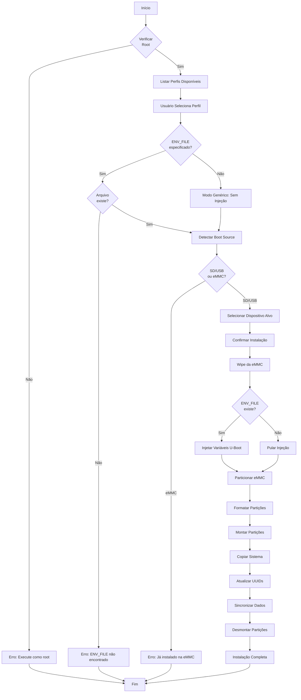

# Armbian Installer for AMLogic TV Boxes

[](https://opensource.org/licenses/MIT)
[](https://www.gnu.org/software/bash/)
[](https://www.armbian.com/)
[](https://en.wikipedia.org/wiki/Amlogic)

> **Language / Idioma:** [English](README.en.md) | **[🟢 Português]**

Instalador automatizado para transferir **Armbian** de pendrive/SD para eMMC em TV Boxes AMLogic, com suporte especial para dispositivos com bootloader locked. Desenvolvido especificamente para Armbian, mas adaptável para outras distribuições Linux ARM com conhecimentos técnicos.

**Autor:** [Pedro Rigolin](https://github.com/pedrohrigolin)

**Projeto:** Desenvolvido para o [Projeto TVBox](https://github.com/projetotvbox) do **Instituto Federal de São Paulo (IFSP)**, Campus Salto

---

## � Sumário

- [📦 Sobre o Projeto TVBox](#-sobre-o-projeto-tvbox)
- [🔍 Visão Geral](#-visão-geral)
  - [🎯 Contexto e Motivação](#-contexto-e-motivação)
  - [📋 Estrutura Esperada do Dispositivo de Boot](#-estrutura-esperada-do-dispositivo-de-boot)
  - [🔧 Compatibilidade e Adaptabilidade](#-compatibilidade-e-adaptabilidade)
- [✨ Características](#-características)
- [🚀 Preparação Inicial](#-preparação-inicial)
- [💾 Instalação no Sistema](#-instalação-no-sistema)
- [📱 Uso](#-uso)
  - [Fluxo de Instalação](#fluxo-de-instalação)
  - [Modos de Operação](#modos-de-operação)
- [🔧 Detalhes Técnicos](#-detalhes-técnicos)
  - [Dependências](#dependências)
  - [Arquitetura do Projeto](#arquitetura-do-projeto)
  - [Layout de Partições](#layout-de-partições)
  - [Fluxo Interno Detalhado](#fluxo-interno-detalhado)
- [🔬 Extração de Variáveis U-Boot](#-extração-de-variáveis-u-boot-hardcore-mode)
  - [🎯 Filosofia: "Cada Box é um Universo"](#-filosofia-cada-box-é-um-universo)
  - [⚠️ Pré-Requisitos Obrigatórios](#️-pré-requisitos-obrigatórios)
  - [Método 1: Wipe & Auto-Regeneration](#método-1-wipe--auto-regeneration-exemplo-htv-h8)
  - [Método 2: Análise Ampart](#método-2-análise-ampart-exemplo-btv-e10-atv-a5)
  - [🔧 Conversão de Offsets](#-conversão-de-offsets-referência-rápida)
- [➕ Adicionando Novos Dispositivos](#-adicionando-novos-dispositivos)
- [📋 Logs e Debug](#-logs-e-debug)
- [💡 Notas Técnicas e Dicas Avançadas](#-notas-técnicas-e-dicas-avançadas)
- [🔧 Troubleshooting](#-troubleshooting)
- [🙏 Créditos](#-créditos)
- [� Contribuidores](#-contribuidores)
- [�📄 Licença](#-licença)
- [⚠️ Aviso Legal](#️-aviso-legal)

---

## 📦 Sobre o Projeto TVBox

Este instalador foi desenvolvido como parte do **Projeto TVBox do IFSP Campus Salto**, uma iniciativa que visa dar novo propósito a dispositivos TV Box apreendidos pela Receita Federal.

O projeto realiza a descaracterização desses equipamentos, transformando-os em **mini PCs funcionais** com Linux, proporcionando:
- Reutilização de hardware que seria descartado
- Inclusão digital através de doações para comunidades
- Redução de impacto ambiental (e-waste)
- Capacitação técnica de estudantes

Este código foi desenvolvido especificamente para automatizar a instalação do Armbian em dispositivos AMLogic (S905X/X2/X3), facilitando o processo de reconfiguração em larga escala.

---

## 🔍 Visão Geral

### 🎯 Contexto e Motivação

O **Armbian padrão** utiliza uma **partição única em ext4**, mas muitos dispositivos AMLogic (especialmente TV Boxes dos SoCs S905X/X2/X3/X4) requerem um **particionamento dual** para funcionar corretamente:

```
Partição 1: BOOT (FAT32) → Kernel, DTB, scripts de boot
Partição 2: ROOTFS (ext4) → Sistema de arquivos raiz
```

**O Problema:**  
Quando o sistema Armbian é convertido para essa estrutura de 2 partições (necessária para esses dispositivos), o **instalador oficial do Armbian** (`armbian-install`) **para de funcionar**, pois foi projetado exclusivamente para partição única ext4.

**A Solução:**  
Este instalador **restaura a automação** de transferência do sistema para a eMMC interna, adaptado especificamente para a estrutura dual de partições exigida por TV Boxes AMLogic. Além disso, ele oferece:

- ✅ **Instalação automatizada** de Armbian dual-partition para eMMC
- ✅ **Injeção de variáveis U-Boot** ([por que isso?](#assets-u-boot-environment)) para dispositivos locked
- ✅ **Interface interativa** (TUI) para seleção de dispositivos e perfis
- ✅ **Suporte a perfis específicos** por dispositivo (offsets customizados)

### 📋 Estrutura Esperada do Dispositivo de Boot

O instalador assume que o sistema atual está rodando de um pendrive/cartão SD com a seguinte estrutura:

```
Partição 1: BOOT (FAT32, até 512MB)
Partição 2: ROOTFS (ext4, restante do espaço)
```

### 🔧 Compatibilidade e Adaptabilidade

**Este instalador foi desenvolvido especificamente para o Armbian**, otimizado para sua estrutura de boot e arquivos de configuração (`armbianEnv.txt`, DTBs, etc.).

#### Dispositivos Suportados

| Dispositivo | SoC | Perfil | Status | Observações |
|-------------|-----|--------|--------|-------------|
| **HTV H8** | AMLogic S905X4 | `htv_h8.conf` | ✅ Testado | Offset 128 MB, variáveis regeneradas |
| **BTV E10** | AMLogic S905X3 | `btv_e10.conf` | ✅ Testado | Offset 136 MB, estrutura Amlogic preservada |
| **ATV A5** | AMLogic S905X3 | `atv_a5.conf` | ✅ Testado | Offset 136 MB, estrutura Amlogic preservada |
| **Genérico** | AMLogic S905X/X2/X3/X4 | Sem perfil | ⚠️ Experimental | Offset padrão 128 MB, **sem injeção de variáveis U-Boot** |

**Sobre a instalação genérica:**
- ⚠️ Funciona apenas para dispositivos com **bootloader desbloqueado**
- ⚠️ Não injeta variáveis U-Boot customizadas
- ⚠️ Pode resultar em tela preta se o bootloader não encontrar o kernel
- ✅ Útil para testes iniciais em novos dispositivos
- 💡 Recomendado: Extrair variáveis U-Boot e criar perfil customizado

#### Adaptação para Outras Distribuições

**Pode ser adaptado para outras distribuições Linux?**

✅ **Sim**, desde que a distribuição siga a mesma estrutura de partições (BOOT FAT32 + ROOTFS ext4). Exemplos:
- Debian com particionamento similar
- Ubuntu para ARM
- Outras distros baseadas em Debian/Ubuntu

⚠️ **Porém, requer conhecimentos técnicos**:
- Entendimento de U-Boot e scripts de boot
- Modificação de caminhos e arquivos de configuração no código
- Ajuste de verificações específicas do Armbian
- Testes extensivos para garantir boot correto

**Recomendação:** Se você não tem experiência com bootloaders ARM e shell scripting avançado, use o instalador **apenas com Armbian** conforme projetado.

---

## ✨ Características

- ✅ **Interface interativa** com menus dialog
- ✅ **Detecção automática** de discos eMMC disponíveis
- ✅ **Perfis específicos** por dispositivo (ATV A5, BTV E10, HTV H8)
- ✅ **Injeção de variáveis U-Boot** ([por que isso?](#assets-u-boot-environment)) para dispositivos locked
- ✅ **Logging detalhado** para debug (`/tmp/armbian-install-amlogic.log`)
- ✅ **Sistema de cleanup automático** (desmonta em caso de erro/interrupção)
- ✅ **Verificação de dependências** com instalação automática
- ✅ **Lock de instância única** (previne execuções simultâneas)
- ✅ **Particionamento customizável** por perfil de dispositivo

---

## 🚀 Preparação Inicial

### ⚠️ Descompactação dos Assets (OBRIGATÓRIO)

Os arquivos de variáveis U-Boot (`*.img`) estão **compactados com gzip** no repositório devido ao limite de tamanho do GitHub (100MB). Antes de usar o instalador pela primeira vez, você **DEVE** descompactá-los.

#### Por que os arquivos estão compactados?

Os arquivos `.img` contêm imagens binárias das variáveis do U-Boot extraídas de dispositivos reais. Esses arquivos têm dezenas de megabytes e, quando compactados, reduzem drasticamente de tamanho (tipicamente 90%+), permitindo que sejam versionados no Git.

#### Como descompactar:

**Método Recomendado (Descompacta todos os assets):**

```bash
cd armbian-install-amlogic/assets/
gunzip -k *.img.gz
cd ../..
```

A flag `-k` mantém os arquivos `.gz` originais intactos.

**Método Alternativo (Descompacta um asset específico):**

```bash
# Exemplo: apenas para ATV A5
gunzip -k armbian-install-amlogic/assets/uboot_envs_atv_a5.img.gz
```

#### Verificação

Após descompactar, confirme que os arquivos `.img` existem:

```bash
ls -lh armbian-install-amlogic/assets/*.img
```

Você deve ver arquivos como:
- `uboot_envs_atv_a5.img`
- `uboot_envs_btv_e10.img`
- `uboot_envs_htv_h8.img`

**Sem essa etapa, o instalador falhará** ao tentar injetar as variáveis do U-Boot, resultando em erro durante a instalação.

---

## 💾 Instalação no Sistema

> **📍 Contexto Importante:** Os comandos abaixo devem ser executados **no sistema Armbian rodando do pendrive/cartão SD**. O instalador precisa estar disponível no sistema removível antes de usá-lo para transferir o Armbian para a eMMC interna do dispositivo.

Para instalar o script de forma permanente no sistema Armbian do pendrive/SD, siga os passos abaixo:

### 1. Descompactar Assets

Se ainda não descompactou os assets, consulte a seção **[Preparação Inicial](#preparação-inicial)** para instruções detalhadas.

```bash
cd armbian-install-amlogic/assets/ && gunzip -k *.img.gz && cd ../..
```

### 2. Copiar Script Principal para o Sistema Armbian

```bash
# Copia o script para /usr/bin do sistema Armbian (pendrive/SD)
sudo cp armbian-install-amlogic.sh /usr/bin/armbian-install-amlogic
sudo chmod +x /usr/bin/armbian-install-amlogic
```

### 3. Copiar Configurações e Assets para o Sistema Armbian

```bash
# Copia perfis e assets para /etc do sistema Armbian (pendrive/SD)
sudo cp -r armbian-install-amlogic /etc/
```

### 4. Definir Permissões Corretas

```bash
# Permissões para diretórios (755) e arquivos (644)
sudo chmod -R 755 /etc/armbian-install-amlogic
sudo find /etc/armbian-install-amlogic -type f -exec chmod 644 {} \;
```

**Explicação das permissões:**
- `755` para diretórios: Permite navegação e listagem
- `644` para arquivos: Leitura para todos, escrita apenas para root

### 5. Executar o Instalador

Após a instalação no sistema Armbian do pendrive/SD, execute o instalador para transferir o sistema para a eMMC:

```bash
sudo armbian-install-amlogic
```

---

## 📱 Uso

O instalador apresenta uma interface interativa (TUI) que guiará você através do processo:

### Fluxo de Instalação

1. **Seleção do disco eMMC de destino**
   - Detecta automaticamente discos disponíveis
   - Exclui o disco atual do sistema

2. **Seleção do perfil do dispositivo**
   - Lista perfis disponíveis (ATV A5, BTV E10, HTV H8)
   - Opção "Generic" para dispositivos não listados

3. **Confirmações de segurança**
   - Avisos sobre apagamento de dados
   - Confirmação de dispositivo correto

4. **Instalação automática**
   - Wipe do disco
   - Injeção de variáveis U-Boot (se aplicável)
   - Particionamento e formatação
   - Cópia de dados
   - Configuração de boot

### Modos de Operação

#### 1. Instalação com Perfil (Recomendado)

Selecione o perfil correspondente ao seu dispositivo. O instalador:
- ✅ Carregará configurações específicas
- ✅ Injetará variáveis do U-Boot (se necessário)
- ✅ Aplicará offsets corretos de partições
- ✅ Maximiza chances de boot bem-sucedido

**Dispositivos suportados:**
- ATV A5 (S905X3)
- BTV E10 (S905X2)
- HTV H8 (S905X4)

#### 2. Instalação Genérica (Avançado)

Para dispositivos com bootloader desbloqueado ou não listados:
- ⚠️ **Não injeta** variáveis do U-Boot
- ⚠️ Usa offset conservador (128MB / setor 262144)
- ⚠️ Pode resultar em tela preta em dispositivos locked
- ℹ️ Use apenas se souber o que está fazendo

**Quando usar:**
- Dispositivo tem bootloader desbloqueado
- Você tem certeza de que não precisa de variáveis customizadas
- Está testando um novo modelo

---

## 🔧 Detalhes Técnicos

### Dependências

O script verifica e instala automaticamente as seguintes dependências:

- `pv` - Visualizador de progresso para operações de disco
- `dialog` - Interface TUI para menus interativos
- `dosfstools` - Ferramentas para sistema de arquivos FAT32 (mkfs.vfat)
- `rsync` - Sincronização eficiente de arquivos

### Arquitetura do Projeto

```
armbian-install-amlogic-project/
├── armbian-install-amlogic.sh      # Script principal do instalador
└── armbian-install-amlogic/
    ├── assets/                     # Variáveis do U-Boot (binários .img)
    │   ├── uboot_envs_atv_a5.img.gz
    │   ├── uboot_envs_btv_e10.img.gz
    │   └── uboot_envs_htv_h8.img.gz
    └── profiles/                   # Configurações por dispositivo
        ├── atv_a5.conf
        ├── btv_e10.conf
        └── htv_h8.conf
```

#### Assets (U-Boot Environment)

Os arquivos `.img` em `assets/` contêm variáveis de ambiente do U-Boot pré-configuradas. Esses binários são injetados diretamente na eMMC em offsets específicos, instruindo o bootloader onde encontrar o kernel Linux.

**Por que isso é necessário?**

O bootloader de fábrica da **Amlogic** geralmente vem com variáveis U-Boot **restritivas**, permitindo boot apenas em sistemas específicos para os quais foram configurados originalmente.

**O problema:**

1. **Fabricantes de TV Box** alteram essas variáveis para serem **mais permissivas**, facilitando:
   - Boot em múltiplos sistemas operacionais
   - Processos de recuperação
   - Maior flexibilidade de firmware

2. **Durante o wipe/zeroing da eMMC**, essas variáveis permissivas customizadas pelos fabricantes são **apagadas**

3. **Após a instalação**, o bootloader volta às configurações restritivas da Amlogic de fábrica

4. **Resultado:** O sistema Armbian instalado **não consegue dar boot**, mesmo estando corretamente instalado

**A solução (Assets):**

Os arquivos `.img` nos assets **preservam e reinjetam** as variáveis permissivas do fabricante após a instalação, garantindo que:
- O Armbian boote corretamente da eMMC
- Scripts de boot (`s905_autoscript`, `emmc_autoscript`) sejam encontrados
- Boot alternativo por SD/USB continue funcionando
- O sistema tenha a mesma flexibilidade do Android/firmware original

**Quando os assets NÃO são necessários?**

Se o seu dispositivo possui **bootloader desbloqueado ou já é permissivo de fábrica** (não foi customizado pelo fabricante), você pode usar tranquilamente a **instalação genérica** sem injeção de variáveis U-Boot. Neste caso:
- O bootloader já procura kernels em múltiplas mídias (SD/USB/eMMC)
- Não há variáveis customizadas que serão perdidas no wipe
- A instalação funcionará normalmente sem os assets

#### Profiles (Configuração por Dispositivo)

Cada arquivo `.conf` contém:

| Campo | Descrição |
|-------|-----------|
| `BOARD_NAME` | Nome legível do dispositivo (ex: "ATV A5 (S905X3)") |
| `AUTHOR` | Autor do perfil |
| `ENV_OFFSET` | Setor onde injetar as variáveis do U-Boot (geralmente 0) |
| `ENV_FILE` | Caminho para o arquivo `.img` das variáveis |
| `LINUX_START_SECTOR` | Setor inicial da primeira partição (customizado por dispositivo) |

### Layout de Partições

#### Configuração Padrão

```
eMMC Layout:
┌─────────────────────┬──────────────────┬───────────────────────┐
│  Reserved Area      │  BOOT (FAT32)    │   ROOTFS (ext4)       │
│  (varia por perfil) │  (512MB)         │   (restante)          │
│  Início → Offset    │  Offset+         │   Calculado           │
└─────────────────────┴──────────────────┴───────────────────────┘
```

- **Reserved Area**: Região inicial reservada para variáveis U-Boot injetadas (tamanho varia por dispositivo)
- **BOOT Partition**: 512MB FAT32, contém kernel, DTB, scripts de boot
- **ROOTFS Partition**: ext4, ocupa todo espaço restante

#### Customização via Perfil

Cada dispositivo define seu próprio `LINUX_START_SECTOR` (onde começa a partição BOOT):

| Perfil | LINUX_START_SECTOR | Tamanho Reserved | Método Extração |
|--------|-------------------|------------------|-----------------|
| HTV H8 | 262144 | 128 MB | Método 1 (Regeneração) |
| BTV E10 | 278528 | 136 MB | Método 2 (Ampart) |
| ATV A5 | 278528 | 136 MB | Método 2 (Ampart) |

O offset correto é determinado durante o processo de extração das variáveis U-Boot (veja [Extração de Variáveis U-Boot](#extração-de-variáveis-u-boot-hardcore-mode)).

#### Offset de Particionamento Seguro

O instalador usa um **offset inicial customizado por perfil** para garantir que as partições Linux não sobrescrevam as variáveis U-Boot injetadas.

**Exemplos de offsets utilizados:**

| Dispositivo | Offset (setores) | Tamanho (MB) | Método / Motivo |
|-------------|------------------|--------------|--------|
| **HTV H8** | 262144 | 128 MB | Método 1 - Variáveis regeneradas, offset conservador |
| **BTV E10** | 278528 | 136 MB | Método 2 - Estrutura Amlogic preservada via ampart |
| **ATV A5** | 278528 | 136 MB | Método 2 - Estrutura Amlogic preservada via ampart |
| **Generic** | 262144 | 128 MB | Sem perfil - Margem conservadora |

**Por que o offset é necessário?**
- Deixar espaço para as variáveis U-Boot injetadas
- Evitar conflito com estruturas residuais do Android
- Garantir alinhamento adequado para performance da eMMC
- Acomodar diferentes layouts de dispositivos AMLogic

**Regra de Ouro:** Cada perfil define seu `LINUX_START_SECTOR` baseado no método de extração usado (Método 1 ou 2). O instalador **nunca** começa partições Linux antes dessa posição segura.

### Fluxo Interno Detalhado

Este diagrama mostra o fluxo de execução interno do instalador, incluindo todas as etapas de verificação, particionamento, e injeção de variáveis:



> **Nota para Desenvolvedores**: 
> - **Validação de perfil**: O instalador valida apenas se o `ENV_FILE` especificado existe no caminho configurado. Se o arquivo não existir, aborta com erro.
> - **Injeção de variáveis**: As variáveis U-Boot são injetadas no offset definido em `ENV_OFFSET` (varia por dispositivo: 0, 237568, etc.) usando `dd` com `seek`.
> - **Modo Genérico**: Se `ENV_FILE` e `ENV_OFFSET` não forem definidos no perfil, o instalador desabilita injeção automaticamente mas continua a instalação.

### Operações de Disco

```bash
# Wipe completo
dd if=/dev/zero | pv | dd of=/dev/mmcblkX bs=1M oflag=direct

# Criação de partições (fdisk)
- MBR partition table
- P1: Bootable, Type 0xC (W95 FAT32 LBA), 512MB
- P2: Type 0x83 (Linux), restante

# Formatação
mkfs.vfat -F 32 -n BOOT /dev/mmcblkXp1
mkfs.ext4 -F -q -L ROOTFS /dev/mmcblkXp2
```

### Cópia de Dados

**BOOT Partition:**
```bash
cp -rL /mnt/src_boot/* /mnt/tgt_boot/
```

**ROOTFS Partition:**
```bash
rsync -aAXv --delete \
  --exclude={"/dev/*","/proc/*","/sys/*","/tmp/*","/run/*","/mnt/*","/media/*","/lost+found"} \
  /mnt/src_root/ /mnt/tgt_root/
```

### Injeção de Variáveis U-Boot

```bash
dd if=uboot_envs_device.img of=/dev/mmcblkX bs=512 seek=$ENV_OFFSET conv=notrunc
```

Escreve variáveis diretamente no offset especificado (geralmente setor 0).

### Atualização de Configurações

1. **armbianEnv.txt**: Atualiza `rootdev=UUID=xxxx` com novo UUID
   - Se o arquivo já existir: apenas atualiza o UUID da root
   - Se não existir: cria do zero e solicita seleção de DTB
2. **fstab**: Atualiza entradas BOOT e ROOTFS com novos UUIDs
3. **DTB Selection** (apenas se armbianEnv.txt não existir): Menu interativo para selecionar o Device Tree Blob correto para o hardware

---

## 🔬 Extração de Variáveis U-Boot (Hardcore Mode)

Esta seção é destinada a **desenvolvedores e entusiastas avançados** que desejam adicionar suporte para novos dispositivos. O processo exige conhecimentos de hardware e interface serial.

### 🎯 Filosofia: "Cada Box é um Universo"

Diferente de PCs padrão, **cada modelo de TV Box** pode ter uma arquitetura de bootloader completamente diferente:

- **HTV H8:** Bootloader regenera variáveis automaticamente após wipe → Método 1
- **BTV E10 / ATV A5:** Bootloader rígido, exige preservação da estrutura → Método 2
- **Seu dispositivo:** Pode ser qualquer um dos casos acima

**Não existe bala de prata.** Existe diagnóstico, teste e adaptação. Os métodos abaixo são **ferramentas de engenharia reversa**, não receitas fixas.

### ⚠️ Pré-Requisitos Obrigatórios

1. **Sistema Linux ARM funcional** rodando de pendrive/SD no dispositivo AMLogic alvo
   - Pode ser Armbian, Debian, Ubuntu ARM, etc.
   - Necessário para acessar a eMMC interna e executar comandos de análise/extração
   - O sistema precisa bootar corretamente para você ter acesso shell
   
2. **Adaptador Serial TTL (UART)** de boa qualidade (3.3V, **NUNCA 5V!**)
3. Habilidades com soldagem para acessar TX/RX/GND na placa
4. Software de terminal serial (PuTTY, Minicom, picocom)
5. **Paciência e metodologia**

> **🔴 Atenção:** A interface serial UART é **obrigatória para AMBOS os métodos de extração** apresentados nesta seção. Não há como extrair e configurar variáveis U-Boot adequadamente sem acesso serial ao bootloader.

**Configuração Serial Típica:**
- Baud Rate: **115200** (padrão Amlogic) ou **1500000** (alguns modelos)
- Data Bits: 8
- Stop Bits: 1  
- Parity: None
- Flow Control: None

```bash
# Exemplo com picocom
picocom -b 115200 /dev/ttyUSB0

# Se não aparecer nada, tente baud rate alternativo
picocom -b 1500000 /dev/ttyUSB0
```

### 🔒 Regra de Ouro: SEMPRE FAÇA BACKUP!

Antes de qualquer experimento, faça backup completo da eMMC:

```bash
# Backup bit-a-bit com compressão (economiza espaço no pendrive)
sudo dd if=/dev/mmcblkX bs=1M status=progress | gzip -c > backup_emmc_full.img.gz

# Para restaurar em caso de desastre:
# gunzip -c backup_emmc_full.img.gz | sudo dd of=/dev/mmcblkX bs=1M status=progress
```

**Por que gzip?** Um backup de 16GB vira ~2-4GB compactado, economizando muito espaço.

---

### Método 1: "Wipe & Auto-Regeneration" (Exemplo: HTV H8)

Este método funciona em dispositivos onde o **bootloader de fábrica** (geralmente em SPI Flash ou partições protegidas) consegue recriar suas variáveis de ambiente em um offset favorável após um wipe total.

#### Passo 1: O Apagão Total

Após o backup, destrua completamente a estrutura da eMMC:

```bash
# Zera TODA a eMMC (sem dó)
sudo dd if=/dev/zero of=/dev/mmcblkX bs=1M status=progress conv=fsync
```

#### Passo 2: Interceptação via Serial

1. **Desligue** a box da tomada
2. **Conecte** a interface serial aos pinos TX/RX/GND
3. **Abra** o terminal serial no PC (ex: `picocom -b 115200 /dev/ttyUSB0`)
4. **Ligue** a box e pressione **Enter** ou **Espaço** repetidamente
5. Você cairá no prompt do U-Boot (ex: `sc2_ah212=>` ou `=>`)

#### Passo 3: Configuração das Variáveis

Execute os seguintes comandos **um por vez** no prompt do U-Boot:

```text
setenv start_autoscript 'if mmcinfo; then run start_mmc_autoscript; fi; if usb start; then run start_usb_autoscript; fi; run start_emmc_autoscript'
setenv start_emmc_autoscript 'if fatload mmc 1 1020000 emmc_autoscript; then setenv devtype "mmc"; setenv devnum 1; autoscr 1020000; fi;'
setenv start_mmc_autoscript 'if fatload mmc 0 1020000 s905_autoscript; then setenv devtype "mmc"; setenv devnum 0; autoscr 1020000; fi;'
setenv start_usb_autoscript 'for usbdev in 0 1 2 3; do if fatload usb ${usbdev} 1020000 s905_autoscript; then setenv devtype "usb"; setenv devnum 0; autoscr 1020000; fi; done'
setenv bootcmd 'run start_autoscript'
setenv bootdelay 1
```

Salve e reinicie:

```text
saveenv
reset
```

> **💡 Dica Importante:** Essas variáveis configuradas acima (`start_autoscript`, `start_emmc_autoscript`, etc.) são **altamente recomendadas para ambos os métodos** (Método 1 e Método 2). Elas garantem que o bootloader procure scripts de boot nas diferentes mídias (eMMC, SD/USB) na ordem correta, permitindo que o Armbian inicie adequadamente.

#### Passo 4: Teste de Persistência

Após o reboot, **intercepte novamente** o U-Boot e verifique:

```text
printenv
```

**Análise do resultado:**

- ✅ **Variáveis presentes?** A placa passou no teste! Continue para o Passo 5.
- ❌ **Variáveis sumiram?** O bootloader não regenera de forma confiável. Pule para o **Método 2 (Ampart)**.

#### Passo 5: Boot pelo Pendrive e Análise

Conecte o pendrive com Armbian e deixe o boot prosseguir. Após o sistema iniciar:

**A Lógica do Diagnóstico:**  
Como formatamos a eMMC inteira com zeros (`0x00`), **qualquer dado diferente de zero** é algo que o U-Boot gravou ao executar `saveenv`.

```bash
# Procura a string "bootcmd=" nos primeiros 138MB
sudo hexdump -C -n 144703488 /dev/mmcblkX | grep -C 5 "bootcmd="
```

**Exemplo de saída (HTV H8):**

```
07400000  00 00 00 00 62 6f 6f 74  63 6d 64 3d 72 75 6e 20  |....bootcmd=run |
07400010  73 74 61 72 74 5f 61 75  74 6f 73 63 72 69 70 74  |start_autoscript|
```

Note a primeira coluna: `07400000` (hexadecimal) = **116 MB** em decimal.

#### Passo 6: Cálculo do Corte Preciso

**⚠️ IMPORTANTE:** Não copie desde o byte 0! Extraia **apenas a região das variáveis U-Boot**, usando `skip` para pular até o offset identificado.

**Cálculo baseado no exemplo (HTV H8):**

1. **Offset onde começam as variáveis:** 116 MB (0x07400000 do hexdump)
2. **Tamanho a extrair:** 8 MB (típico seguro para variáveis U-Boot)

```bash
# Extrai APENAS a região das variáveis (116MB até 116MB+8MB)
sudo dd if=/dev/mmcblkX of=uboot_envs_htv_h8.img bs=1M skip=116 count=8 status=progress
```

**Explicação dos parâmetros:**
- `skip=116`: Pula os primeiros 116 MB (offset onde as variáveis começam)
- `count=8`: Extrai apenas 8 MB a partir desse ponto
- **Resultado:** Arquivo de 8 MB contendo exatamente as variáveis U-Boot

**Anote para o profile:**

**1. Calcular ENV_OFFSET (em setores):**

```bash
# Fórmula: MB × 2048 = setores
# Exemplo HTV H8: 116 MB das variáveis
echo $((116 * 2048))  # Resultado: 237568 setores
```

- `ENV_OFFSET` = **237568** setores
  - **Por quê?** O instalador usa `dd` com `seek=$ENV_OFFSET` para injetar o arquivo `.img` na posição correta da eMMC de destino
  - **Conversão:** 116 MB × 2048 = 237568 setores (1 setor = 512 bytes)

**2. Calcular LINUX_START_SECTOR:**

**📊 Regra Condicional:**

```bash
# Fórmula base: offset_mb + tamanho_header_mb + 4 (margem)
# Se resultado < 128 MB → usar 128 MB (mínimo seguro)
# Se resultado ≥ 128 MB → usar o cálculo exato

# Exemplo HTV H8:
# offset_mb=116, tamanho_header=8, margem=4
# Cálculo: 116 + 8 + 4 = 128 MB
# Como 128 >= 128 → usar 128 MB

echo $((128 * 2048))  # Resultado: 262144 setores
```

**Exemplo condicional (caso o cálculo dê < 128 MB):**

```bash
# Supondo offset_mb=50, tamanho_header=8, margem=4
# Cálculo: 50 + 8 + 4 = 62 MB
# Como 62 < 128 → usar 128 MB (padrão mínimo)

echo $((128 * 2048))  # Resultado: 262144 setores
```

**Exemplo condicional (caso o cálculo dê > 128 MB):**

```bash
# Supondo offset_mb=120, tamanho_header=10, margem=4
# Cálculo: 120 + 10 + 4 = 134 MB
# Como 134 > 128 → usar 134 MB (cálculo exato)

echo $((134 * 2048))  # Resultado: 274432 setores
```

- `LINUX_START_SECTOR` = **262144** setores (128 MB) → caso HTV H8
  - **Por quê 128 MB mínimo?** Garante espaço suficiente para estruturas de bootloader e variáveis U-Boot
  - **Margem de 4 MB:** Segurança adicional contra fragmentação/alinhamento
  - **Lógica:** `max(128 MB, offset_mb + tamanho_header + 4)`

---

### Método 2: "Análise Ampart" (Exemplo: BTV E10, ATV A5)

Este método é necessário quando o dispositivo **não regenera** variáveis de ambiente de forma confiável após wipe total.

> **⚠️ Requisito:** Assim como o Método 1, este método **também requer interface serial UART** para interceptar o U-Boot e aplicar as variáveis recomendadas do Passo 3. A diferença está na estratégia de extração do arquivo.

#### Instalação do Ampart

A ferramenta `ampart` é específica para dispositivos Amlogic e não vem pré-instalada:

```bash
# Clone o repositório
git clone https://github.com/7Ji/ampart.git
cd ampart

# Compile e instale
make
sudo make install

# Verifique a instalação
ampart --help
```

**Fonte:** [7Ji/ampart](https://github.com/7Ji/ampart)

#### Passo 1: Preparação

Se tentou o Método 1 e falhou, restaure o backup original:

```bash
gunzip -c backup_emmc_full.img.gz | sudo dd of=/dev/mmcblkX bs=1M status=progress
```

#### Passo 2: Executar Simulação Ampart

Com o sistema **original** (ou backup restaurado) funcionando:

```bash
# Simula reorganização da tabela de partições
sudo ampart /dev/mmcblkX --mode dclone data::-1:4
```

#### Passo 3: Análise Detalhada do Relatório

O ampart exibirá uma tabela **EPT** (Extended Partition Table). Procure pelas linhas `env` e `data`:

**Exemplo de saída:**

```
EPT report: 5 partitions in the table
 0: bootloader    0 (   0.00M)        400000 (   4.00M)
 1: reserved  400000 (   4.00M)       4000000 (  64.00M)
 2: cache    4400000 (  68.00M)        800000 (   8.00M)
 3: env      7400000 ( 116.00M)        800000 (   8.00M)
 4: data     8400000 ( 132.00M)     39ba00000 (  14.43G)
```

**Interpretação Crítica:**

| Partição | Offset | Tamanho | Significado |
|----------|--------|---------|-------------|
| `bootloader` | 0 MB | 4 MB | Bootloader primário |
| `reserved` | 4 MB | 64 MB | Área reservada (DTB, etc.) |
| `cache` | 68 MB | 8 MB | Cache (geralmente ignorado) |
| **`env`** | **116 MB** | **8 MB** | **Variáveis U-Boot (CRÍTICO!)** |
| **`data`** | **132 MB** | restante | **Início do espaço livre** |

**Regra de Extração:**  
Extraia desde o byte 0 até o **início da partição `data`** (132 MB no exemplo).

```bash
# Extrai exatamente os primeiros 132 MB (conforme relatório ampart)
sudo dd if=/dev/mmcblkX of=uboot_envs_btv_e10.img bs=1M count=132 status=progress
```

**Anote para o profile:**

**1. Calcular ENV_OFFSET:**

- `ENV_OFFSET` = **0** (zero)
  - **Por quê?** No Método 2, extraímos **desde o byte 0** (incluindo bootloader, reserved, cache, env)
  - Durante a instalação, o `dd` injeta o arquivo inteiro desde o início da eMMC
  - As variáveis U-Boot já estão na posição correta dentro do arquivo extraído

**2. Calcular LINUX_START_SECTOR:**

**📊 Regra Condicional:**

```bash
# Fórmula base: inicio_data_mb + 4 (margem)
# Se resultado < 128 MB → usar 128 MB (mínimo seguro)
# Se resultado ≥ 128 MB → usar o cálculo exato

# Exemplo BTV E10:
# inicio_data=132 MB (do relatório ampart), margem=4
# Cálculo: 132 + 4 = 136 MB
# Como 136 > 128 → usar 136 MB (cálculo exato)

echo $((136 * 2048))  # Resultado: 278528 setores
```

**Exemplo condicional (caso o cálculo dê < 128 MB):**

```bash
# Supondo inicio_data=100 MB, margem=4
# Cálculo: 100 + 4 = 104 MB
# Como 104 < 128 → usar 128 MB (padrão mínimo)

echo $((128 * 2048))  # Resultado: 262144 setores
```

- `LINUX_START_SECTOR` = **278528** setores (136 MB) → caso BTV E10
  - **Por quê 128 MB mínimo?** Garante espaço suficiente para estruturas do Android/Amlogic preservadas
  - **Lógica:** `max(128 MB, inicio_data_mb + 4)`
  - **Conversão:** 136 MB × 2048 = 278528 setores

#### Passo 4: Validação

Para garantir que capturou corretamente:

```bash
# Verifica se existe "bootcmd" no arquivo extraído
strings uboot_envs_btv_e10.img | grep -i "bootcmd"
```

Se encontrar strings como `bootcmd=`, `start_autoscript`, etc., a extração foi bem-sucedida!

> **💡 Recomendação Importante:** Antes de finalizar a extração, é **altamente recomendado** acessar o U-Boot via serial UART e configurar as variáveis do **Passo 3: Configuração das Variáveis** (seção do Método 1). Após aplicar essas variáveis (`setenv start_autoscript`, `saveenv`, etc.), faça a extração novamente com `dd` para garantir que o arquivo `.img` contenha as configurações otimizadas de boot. Isso garante melhor compatibilidade e inicialização em diferentes mídias (SD/USB/eMMC).

---

### 📊 Comparação dos Métodos

| Aspecto | Método 1 (Wipe & Regen) | Método 2 (Ampart) |
|---------|-------------------------|-------------------|
| Complexidade | Média | Alta |
| Arquivo Resultante | Limpo (só zeros + env) | Sujo (restos do Android) |
| Tamanho Típico | 32-64 MB | 132 MB |
| Requer Serial UART | ✅ Obrigatório | ✅ Obrigatório |
| Exemplo | HTV H8 | BTV E10, ATV A5 |

> **⚠️ Importante:** Ambos os métodos exigem interface serial UART para interceptar o U-Boot e configurar as variáveis de boot. A diferença está na estratégia de extração do arquivo de variáveis.

---

### 🔧 Conversão de Offsets (Referência Rápida)

Esta seção é **crítica** para configurar corretamente os valores `ENV_OFFSET` e `LINUX_START_SECTOR` nos perfis de dispositivos.

#### Fundamentos

- **1 setor = 512 bytes**
- **1 MB = 1024 × 1024 bytes = 1048576 bytes**
- **1 MB = 2048 setores** (fórmula simplificada: MB × 2048)

#### Conversões Essenciais

**1. Hexadecimal (hexdump) → Decimal (bytes):**

```bash
# Exemplo: 0x07400000 do hexdump
echo $((0x07400000))  # Resultado: 121634816 bytes
```

**2. Bytes → Megabytes:**

```bash
# Dividir por 1024 duas vezes (ou 1048576)
echo $((121634816 / 1024 / 1024))  # Resultado: 116 MB
```

**3. Megabytes → Setores (MAIS IMPORTANTE!):**

```bash
# Fórmula simplificada: MB × 2048
echo $((116 * 2048))  # Resultado: 237568 setores

# Fórmula completa (MB × 1024 × 1024 / 512):
echo $((116 * 1024 * 1024 / 512))  # Resultado: 237568 setores
```

**4. Setores → Megabytes (verificação reversa):**

```bash
# Dividir por 2048
echo $((237568 / 2048))  # Resultado: 116 MB
```

#### Exemplos Práticos

**Exemplo 1: HTV H8 (Método 1)**

```bash
# Hexdump mostra: 07400000
# Passo 1: Hex → Decimal
echo $((0x07400000))  # = 121634816 bytes

# Passo 2: Bytes → MB
echo $((121634816 / 1024 / 1024))  # = 116 MB

# Passo 3: MB → Setores (ENV_OFFSET)
echo $((116 * 2048))  # = 237568 setores ✅

# Passo 4: LINUX_START_SECTOR (116 + 8 extraídos + 4 margem = 128 MB)
echo $((128 * 2048))  # = 262144 setores ✅
```

**Resultado:**
- `ENV_OFFSET=237568`
- `LINUX_START_SECTOR=262144`

**Exemplo 2: BTV E10 (Método 2 - Ampart)**

```bash
# Relatório Ampart mostra partição 'data' em 132 MB
# ENV_OFFSET = 0 (extraímos desde o início)

# LINUX_START_SECTOR: data (132 MB) + margem (4 MB) = 136 MB
echo $((136 * 2048))  # = 278528 setores ✅
```

**Resultado:**
- `ENV_OFFSET=0`
- `LINUX_START_SECTOR=278528`

#### Atalho para Terminal

Salve este alias no seu `~/.bashrc` para conversão rápida:

```bash
# Adicione ao ~/.bashrc
alias mb2sec='echo "Conversão MB → Setores:"; read -p "Digite MB: " mb; echo "$((mb * 2048)) setores"'
alias hex2mb='echo "Conversão Hex → MB:"; read -p "Digite hex (ex: 0x07400000): " hex; echo "$((hex / 1024 / 1024)) MB"'

# Recarregue o bashrc
source ~/.bashrc

# Uso:
mb2sec  # Digite 116 → Resultado: 237568 setores
hex2mb  # Digite 0x07400000 → Resultado: 116 MB
```

#### 🎯 Regra Crítica: LINUX_START_SECTOR Mínimo

**Esta é a regra mais importante para garantir que o dispositivo boote corretamente:**

```bash
# Regra: LINUX_START_SECTOR = max(128 MB, cálculo_base)
# Onde cálculo_base varia por método:

# Método 1: offset_mb + tamanho_header_mb + 4
# Método 2: inicio_data_mb + 4

# Exemplos:
# Se cálculo_base = 62 MB  → usar 128 MB (262144 setores)
# Se cálculo_base = 128 MB → usar 128 MB (262144 setores)
# Se cálculo_base = 136 MB → usar 136 MB (278528 setores)
```

**Por que 128 MB é o mínimo absoluto?**

- Garante espaço suficiente para bootloader, partições reservadas, e variáveis U-Boot
- Evita conflitos com estruturas residuais do sistema Android original
- Proporciona margem de segurança contra fragmentação e desalinhamento de setores
- Compatibilidade com a maioria dos dispositivos AMLogic S905X/X2/X3/X4

**⚠️ NUNCA use valores menores que 262144 setores (128 MB) para LINUX_START_SECTOR!**

---

## ➕ Adicionando Novos Dispositivos

Após extrair as variáveis usando um dos métodos acima:

### 1. Preparar Assets

Copie e **comprima** o arquivo `.img` extraído para o diretório de assets:

```bash
# Copie o arquivo para o diretório de assets
cp uboot_envs_mydevice.img armbian-install-amlogic/assets/

# Comprima com máxima compressão (IMPORTANTE para o Git)
gzip -9 armbian-install-amlogic/assets/uboot_envs_mydevice.img
```

**Por que comprimir?**  
Arquivos `.img` excedem o limite de 100MB do GitHub. A compressão gzip reduz drasticamente o tamanho (geralmente >90%), permitindo versionamento no Git. Os usuários descompactam antes de instalar (veja seção [Preparação Inicial](#preparação-inicial)).

**Resultado:** Você terá `uboot_envs_mydevice.img.gz` pronto para commit.

### 2. Criar Profile

Crie um novo arquivo de configuração em `armbian-install-amlogic/profiles/`:

#### Exemplo Método 1 (Wipe & Regen - como HTV H8)

**Cenário:** Hexdump mostrou variáveis em `0x07400000`, extraímos 8 MB.

**Cálculos:**

```bash
# ENV_OFFSET: converter offset hex para setores
echo $((0x07400000 / 1024 / 1024))  # = 116 MB
echo $((116 * 2048))                 # = 237568 setores ✅

# LINUX_START_SECTOR: aplicar regra condicional
# Base: offset + tamanho extraído + margem = 116 + 8 + 4 = 128 MB
# Regra: se < 128 MB → usar 128 MB, senão usar cálculo
# Como 128 >= 128 → usar 128 MB
echo $((128 * 2048))                 # = 262144 setores ✅
```

**Arquivo:** `armbian-install-amlogic/profiles/mydevice_method1.conf`

```properties
BOARD_NAME="My Device Method1 (S905X4)"
AUTHOR="Your Name"
ENV_OFFSET=237568
ENV_FILE="/etc/armbian-install-amlogic/assets/uboot_envs_mydevice.img"
LINUX_START_SECTOR=262144
```

#### Exemplo Método 2 (Ampart - como BTV E10)

**Cenário:** Ampart mostrou partição `data` começando em 132 MB, extraímos desde byte 0.

**Cálculos:**

```bash
# ENV_OFFSET: Método 2 sempre usa 0 (extração desde início)
# ENV_OFFSET = 0 ✅

# LINUX_START_SECTOR: aplicar regra condicional
# Base: início data + margem = 132 + 4 = 136 MB
# Regra: se < 128 MB → usar 128 MB, senão usar cálculo
# Como 136 > 128 → usar 136 MB (cálculo exato)
echo $((136 * 2048))  # = 278528 setores ✅
```

**Arquivo:** `armbian-install-amlogic/profiles/mydevice_method2.conf`

```properties
BOARD_NAME="My Device Method2 (S905X3)"
AUTHOR="Your Name"
ENV_OFFSET=0
ENV_FILE="/etc/armbian-install-amlogic/assets/uboot_envs_mydevice.img"
LINUX_START_SECTOR=278528
```

#### Validação dos Valores

**Antes de salvar o profile, valide:**

```bash
# 1. ENV_OFFSET deve ser um número inteiro de setores
# 2. LINUX_START_SECTOR deve ser maior que ENV_OFFSET (se ENV_OFFSET != 0)
# 3. LINUX_START_SECTOR mínimo: 262144 (128 MB) - nunca menos que isso!
# 4. LINUX_START_SECTOR típico: 262144 (128 MB) ou 278528 (136 MB)

# Verificar se conversão está correta (exemplo 116 MB):
echo $((116 * 2048))      # Deve retornar 237568
echo $((237568 / 2048))   # Deve retornar 116 (verificação reversa)

# Validar regra condicional:
# Se seu cálculo deu < 128 MB, SEMPRE usar 128 MB (262144 setores)
```

**⚠️ Valores críticos - erros aqui resultam em:**
- Partições sobrescrevendo variáveis U-Boot → Device não boota
- Offsets incorretos → Bootloader não encontra variáveis → Tela preta
- **LINUX_START_SECTOR < 128 MB → Espaço insuficiente → Falha garantida**

### 3. Instalar no Sistema Armbian

Copie o script principal e as configurações para o sistema:

```bash
# Copia o script para /usr/bin do sistema Armbian (pendrive/SD)
sudo cp armbian-install-amlogic.sh /usr/bin/armbian-install-amlogic
sudo chmod +x /usr/bin/armbian-install-amlogic

# Copia perfis e assets para /etc do sistema Armbian (pendrive/SD)
sudo cp -r armbian-install-amlogic /etc/
```

### 4. Definir Permissões Corretas

```bash
# Permissões para diretórios (755) e arquivos (644)
sudo chmod -R 755 /etc/armbian-install-amlogic
sudo find /etc/armbian-install-amlogic -type f -exec chmod 644 {} \;
```

**Explicação das permissões:**
- `755` para diretórios: Permite navegação e listagem
- `644` para arquivos: Leitura para todos, escrita apenas para root

### 5. Teste

Execute o instalador e verifique se o novo perfil aparece na lista de seleção:

```bash
sudo armbian-install-amlogic
```

Se tudo estiver correto, o nome do dispositivo (`BOARD_NAME`) aparecerá no menu de seleção.

> **⚡ Teste Real Obrigatório:** Não basta o perfil aparecer no menu! Execute a **instalação completa** para a eMMC e verifique se o dispositivo realmente boota corretamente. Teste:
> - Boot bem-sucedido da eMMC
> - Detecção correta de hardware
> - Conectividade (Ethernet/Wi-Fi)
> - Funcionalidade geral do sistema
> 
> Só considere o perfil funcional após boot real bem-sucedido!

### 6. Contribua!

Se o perfil funcionar perfeitamente, considere contribuir com o projeto:
- Abra uma Pull Request com o profile e asset **compactado (`.img.gz`)**
- Documente peculiaridades do dispositivo
- Inclua fotos dos pontos de soldagem da serial (se possível)

**⚠️ IMPORTANTE para PRs:**  
- Sempre commite arquivos `.img.gz` (compactados), NUNCA `.img` (descompactados)
- O `.gitignore` está configurado para aceitar apenas `.img.gz`
- Verifique o tamanho do arquivo antes do commit (deve ser <100MB)

---

## 📋 Logs e Debug

Todos os logs são gravados em: `/tmp/armbian-install-amlogic.log`

Inclui:
- Detecção de hardware
- Estado das partições
- Comandos executados
- Exit codes
- Mensagens de erro detalhadas

Para debug, execute o script e consulte o log após qualquer falha.

---

## 💡 Notas Técnicas e Dicas Avançadas

### Race Conditions em eMMC

Memórias eMMC são mais lentas que SSDs. O kernel demora para criar os arquivos de dispositivo (`/dev/mmcblkXp1`) após operações de particionamento. O instalador implementa espera ativa:

```bash
partprobe /dev/mmcblkX   # Força releitura da tabela
udevadm settle            # Aguarda estabilização do udev
sleep 2                   # Margem adicional
```

Em dispositivos muito lentos, aumente o `sleep` para 5 segundos.

### Por Que Não Usar `discard` em eMMC Barata?

Muitas eMMCs de TV Box não suportam TRIM corretamente. O uso de flags `discard` no `mount` ou `mkfs` pode causar:
- Erros de I/O durante formatação
- Corrupção silenciosa de dados
- Performance degradada

O instalador **não usa** `discard` por padrão para máxima compatibilidade.

### Diferença Entre `dd` Direct vs Buffered

```bash
# Buffered (mais rápido, mas pode não gravar imediatamente)
dd if=file.img of=/dev/mmcblkX bs=1M

# Direct (mais lento, mas garante escrita física)
dd if=file.img of=/dev/mmcblkX bs=1M oflag=direct conv=fsync
```

O instalador usa `oflag=direct` no wipe para garantir que zeros sejam realmente escritos na eMMC, não apenas no cache.

### Validação de Arquivos `.img` Extraídos

Sempre valide se o arquivo de variáveis extraído contém dados relevantes:

```bash
# Verifica tamanho
ls -lh uboot_envs_device.img

# Procura strings reconhecíveis
strings uboot_envs_device.img | grep -E "bootcmd|bootdelay|start_autoscript"

# Visualiza em hex (primeiros 512 bytes)
hexdump -C uboot_envs_device.img | head -32
```

Se o arquivo estiver vazio ou cheio de zeros, a extração falhou.

---

## 🔧 Troubleshooting

### Tela preta após instalação

**Causa:** Variáveis do U-Boot incorretas, DTB errado, ou offset de partição inadequado.

**Solução:**
1. Verifique se selecionou o perfil correto do dispositivo
2. Confirme o DTB correto para seu SoC:
   - S905X: `meson-gxl-s905x-*.dtb`
   - S905X2: `meson-g12a-s905x2-*.dtb`
   - S905X3: `meson-sm1-s905x3-*.dtb`
3. **Dispositivo novo sem perfil?** Siga a seção **Extração de Variáveis U-Boot** para criar um perfil customizado

### Box não boota da eMMC (volta pro pendrive)

**Causa:** Variáveis do U-Boot não foram injetadas corretamente ou arquivo `.img` está corrompido.

**Solução:**
1. Verifique se o arquivo `ENV_FILE` existe no caminho especificado no profile
2. Valide o conteúdo do arquivo extraído:
   ```bash
   strings /etc/armbian-install-amlogic/assets/uboot_envs_device.img | grep -i "bootcmd"
   ```
3. Se vazio ou sem dados relevantes, refaça a extração via Método 1 ou 2

### Falha ao montar partições

**Causa:** Partições não foram criadas corretamente ou race condition (Kernel ainda não criou `/dev/mmcblkXp1`).

**Solução:** 

1. Verifique o log em `/tmp/armbian-install-amlogic.log`
2. O instalador já possui proteções contra race conditions:
   ```bash
   partprobe /dev/mmcblkX
   udevadm settle
   sleep 2
   ```
3. Em eMMCs muito lentas, pode ser necessário aumentar o `sleep`

### Variáveis U-Boot não persistem após `saveenv`

**Causa:** O bootloader não tem permissão ou espaço para gravar na eMMC, ou a região de environment está corrompida.

**Sintomas:**
- Executa `saveenv` sem erros
- Após `reset` e `printenv`, as variáveis sumiram

**Solução:**
1. **Tente desbloquear escrita:**
   ```text
   mmc dev 1
   mmc info
   ```
   Verifique se o dispositivo não está protegido contra escrita

2. **Use o Método 2 (Ampart):** Este dispositivo provavelmente não regenera variáveis de forma confiável. Restaure o backup e siga o método Ampart para preservar a estrutura original.

### Sistema não inicializa da eMMC

**Causa:** U-Boot ainda está configurado para boot de SD/USB.

**Solução:** 
- Execute a instalação novamente
- Em dispositivos locked, certifique-se de usar um perfil (não genérico)

---

## 🙏 Créditos

**Este é um projeto independente**, desenvolvido do zero com objetivos e arquitetura próprios.

### 🏛️ Reconhecimento Institucional

Desenvolvido para o **Projeto TVBox** do **Instituto Federal de São Paulo (IFSP), Campus Salto**.

O Projeto TVBox é uma iniciativa de impacto social que transforma TV Boxes apreendidas pela Receita Federal em mini PCs com Linux, promovendo:
- Sustentabilidade através da reutilização de hardware
- Inclusão digital em comunidades carentes
- Capacitação técnica de estudantes
- Redução de lixo eletrônico

### 📚 Referências Técnicas

Durante o desenvolvimento, os seguintes projetos foram estudados como referência técnica:

- **Estudado para referência:** [ophub/amlogic-s9xxx-armbian](https://github.com/ophub/amlogic-s9xxx-armbian)
- **Inspiração conceitual:** [unifreq/openwrt_packit](https://github.com/unifreq/openwrt_packit)
- **Ferramenta utilizada (ampart):** [7Ji/ampart](https://github.com/7Ji/ampart)

---

## � Contribuidores

### Autor Principal

- **[Pedro Rigolin](https://github.com/pedrohrigolin)** - Desenvolvedor principal e mantenedor do projeto

### Colaboradores

Este projeto agradece a todos que contribuíram com código, documentação, testes e feedback:

> Veja a lista completa de contribuidores em: [Contributors](https://github.com/projetotvbox/armbian-install-amlogic-project/graphs/contributors)

**Como contribuir:**

Se você deseja contribuir com o projeto:
1. Faça um fork do repositório
2. Crie uma branch para sua feature (`git checkout -b feature/MinhaFeature`)
3. Commit suas mudanças (`git commit -m 'Adiciona nova feature'`)
4. Push para a branch (`git push origin feature/MinhaFeature`)
5. Abra um Pull Request

Todas as contribuições são bem-vindas! 🎉

---

## �📄 Licença

Este projeto é licenciado sob a **MIT License**.

```
MIT License

Copyright (c) 2026 Pedro Rigolin

Developed for Projeto TVBox - Instituto Federal de São Paulo (IFSP), Campus Salto
```

Veja o arquivo [LICENSE](LICENSE) para mais detalhes.

A licença MIT permite uso livre (incluindo comercial), modificação e distribuição, desde que mantidos os créditos originais.

---

## ⚠️ Aviso Legal

⚠️ **USE POR SUA CONTA E RISCO**

Este instalador modifica a memória eMMC do dispositivo. Operações incorretas podem resultar em:
- Perda total de dados
- Dispositivo não inicializável ("brick")
- Perda de garantia

**Sempre faça backup** de dados importantes antes de usar este instalador.

**Compatibilidade:** Este instalador foi desenvolvido e testado especificamente para **Armbian**. O uso com outras distribuições Linux não foi testado e pode resultar em falhas de boot ou problemas de sistema.

O autor não se responsabiliza por danos ao hardware ou perda de dados.
