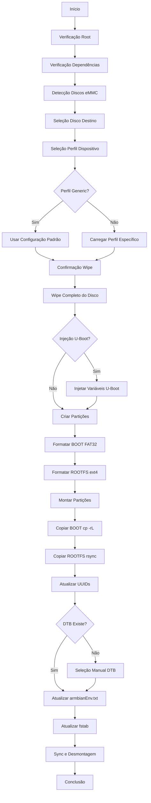

# Armbian Installer for AMLogic TV Boxes

[](https://opensource.org/licenses/MIT)
[](https://www.gnu.org/software/bash/)

Instalador automatizado de Armbian em dispositivos TV Box baseados em AMLogic, com suporte especial para dispositivos com bootloader locked.

**Autor:** [Pedro Rigolin](https://github.com/pedrohrigolin)

**Projeto:** Desenvolvido para o [Projeto TVBox](https://github.com/projetotvbox) do **Instituto Federal de São Paulo (IFSP)**, Campus Salto

---

## 📦 Sobre o Projeto TVBox

Este instalador foi desenvolvido como parte do **Projeto TVBox do IFSP Campus Salto**, uma iniciativa que visa dar novo propósito a dispositivos TV Box apreendidos pela Receita Federal.

O projeto realiza a descaracterização desses equipamentos, transformando-os em **mini PCs funcionais** com Linux, proporcionando:
- Reutilização de hardware que seria descartado
- Inclusão digital através de doações para comunidades
- Redução de impacto ambiental (e-waste)
- Capacitação técnica de estudantes

Este código foi desenvolvido especificamente para automatizar a instalação do Armbian em dispositivos AMLogic (S905X/X2/X3), facilitando o processo de reconfiguração em larga escala.

---

## Visão Geral

Este instalador permite transferir um sistema Armbian rodando em pendrive/cartão SD para a memória eMMC interna de TV Boxes AMLogic (S905X, S905X2, S905X3, etc.). O processo é totalmente interativo via TUI (dialog) e inclui suporte para dispositivos que requerem injeção de variáveis do U-Boot.

### Estrutura Esperada do Dispositivo de Boot

O instalador assume que o sistema atual está rodando de um dispositivo removível com a seguinte estrutura:

```
Partição 1: BOOT (FAT32, até 512MB)
Partição 2: ROOTFS (ext4, restante do espaço)
```

---

## Características

- ✅ **Interface interativa** com menus dialog
- ✅ **Detecção automática** de discos eMMC disponíveis
- ✅ **Perfis específicos** por dispositivo (ATV A5, BTV E10, HTV H8)
- ✅ **Injeção de variáveis U-Boot** para dispositivos locked
- ✅ **Logging detalhado** para debug (`/tmp/armbian-install-amlogic.log`)
- ✅ **Sistema de cleanup automático** (desmonta em caso de erro/interrupção)
- ✅ **Verificação de dependências** com instalação automática
- ✅ **Lock de instância única** (previne execuções simultâneas)
- ✅ **Preservação do bootloader de fábrica** (primeiros 128MB)

---

## Dependências

O script verifica e instala automaticamente as seguintes dependências:

- `pv` - Visualizador de progresso para operações de disco
- `dialog` - Interface TUI para menus interativos
- `dosfstools` - Ferramentas para sistema de arquivos FAT32 (mkfs.vfat)
- `rsync` - Sincronização eficiente de arquivos

---

## Arquitetura do Projeto

```
armbian-install-amlogic-project/
├── armbian-install-amlogic.sh      # Script principal do instalador
└── armbian-install-amlogic/
    ├── assets/                     # Variáveis do U-Boot (binários .img)
    │   ├── uboot_envs_atv_a5.img.gz
    │   ├── uboot_envs_btv_e10.img.gz
    │   └── uboot_envs_htv_h8.img.gz
    └── profiles/                   # Configurações por dispositivo
        ├── atv_a5.conf
        ├── btv_e10.conf
        └── htv_h8.conf
```

### Assets (U-Boot Environment)

Os arquivos `.img` em `assets/` contêm variáveis de ambiente do U-Boot pré-configuradas. Esses binários são injetados diretamente na eMMC em offsets específicos, instruindo o bootloader onde encontrar o kernel Linux.

**Por que isso é necessário?**  
Dispositivos com bootloader locked (HTV, BTV, ATV) não permitem modificação de variáveis do U-Boot via software. A injeção direta no offset correto garante que o bootloader carregue o sistema corretamente.

### Profiles (Configuração por Dispositivo)

Cada arquivo `.conf` contém:

| Campo | Descrição |
|-------|-----------|
| `BOARD_NAME` | Nome legível do dispositivo (ex: "ATV A5 (S905X3)") |
| `AUTHOR` | Autor do perfil |
| `ENV_OFFSET` | Setor onde injetar as variáveis do U-Boot (geralmente 0) |
| `ENV_FILE` | Caminho para o arquivo `.img` das variáveis |
| `LINUX_START_SECTOR` | Setor inicial da primeira partição (customizado por dispositivo) |

---

## Fluxo de Instalação



---

## Layout de Partições

### Configuração Padrão

```
eMMC Layout:
┌─────────────────────┬──────────────────┬───────────────────────┐
│  Bootloader Area    │  BOOT (FAT32)   │   ROOTFS (ext4)      │
│  (0 - 128MB)       │  (512MB)        │   (restante)         │
│  Setor 0-262143    │  Setor 262144+  │   Setor calculado    │
└─────────────────────┴──────────────────┴───────────────────────┘
```

- **Bootloader Area**: Primeiros 128MB (setores 0-262143) preservados para bootloader de fábrica
- **BOOT Partition**: 512MB FAT32, contém kernel, DTB, scripts de boot
- **ROOTFS Partition**: ext4, ocupa todo espaço restante

### Customização via Perfil

Dispositivos podem especificar `LINUX_START_SECTOR` diferente do padrão (262144). Exemplo: BTV E10 usa 278528.

---

## Preparação Inicial

### ⚠️ Descompactação dos Assets (OBRIGATÓRIO)

Os arquivos de variáveis U-Boot (`*.img`) estão **compactados com gzip** no repositório devido ao limite de tamanho do GitHub (100MB). Antes de usar o instalador pela primeira vez, você **DEVE** descompactá-los.

#### Por que os arquivos estão compactados?

Os arquivos `.img` contêm imagens binárias das variáveis do U-Boot extraídas de dispositivos reais. Esses arquivos têm dezenas de megabytes e, quando compactados, reduzem drasticamente de tamanho (tipicamente 90%+), permitindo que sejam versionados no Git.

#### Como descompactar:

**Método Recomendado (Descompacta todos os assets):**

```bash
cd armbian-install-amlogic/assets/
gunzip -k *.img.gz
cd ../..
```

A flag `-k` mantém os arquivos `.gz` originais intactos.

**Método Alternativo (Descompacta um asset específico):**

```bash
# Exemplo: apenas para ATV A5
gunzip -k armbian-install-amlogic/assets/uboot_envs_atv_a5.img.gz
```

#### Verificação

Após descompactar, confirme que os arquivos `.img` existem:

```bash
ls -lh armbian-install-amlogic/assets/*.img
```

Você deve ver arquivos como:
- `uboot_envs_atv_a5.img`
- `uboot_envs_btv_e10.img`
- `uboot_envs_htv_h8.img`

**Sem essa etapa, o instalador falhará** ao tentar injetar as variáveis do U-Boot, resultando em erro durante a instalação.

---

## Instalação no Sistema

Para usar o instalador de forma permanente no sistema, siga os passos abaixo:

### 1. Descompactar Assets (se ainda não fez)

```bash
cd armbian-install-amlogic/assets/
gunzip -k *.img.gz
cd ../..
```

### 2. Copiar Script Principal

```bash
sudo cp armbian-install-amlogic.sh /usr/bin/armbian-install-amlogic
sudo chmod +x /usr/bin/armbian-install-amlogic
```

### 3. Copiar Configurações e Assets

```bash
sudo cp -r armbian-install-amlogic /etc/
```

### 4. Definir Permissões Corretas

```bash
# Permissões para diretórios (755) e arquivos (644)
sudo chmod -R 755 /etc/armbian-install-amlogic
sudo find /etc/armbian-install-amlogic -type f -exec chmod 644 {} \;
```

**Explicação das permissões:**
- `755` para diretórios: Permite navegação e listagem
- `644` para arquivos: Leitura para todos, escrita apenas para root

### 5. Executar o Instalador

Após a instalação, execute de qualquer lugar:

```bash
sudo armbian-install-amlogic
```

---

## Uso

O instalador apresenta uma interface interativa (TUI) que guiará você através do processo:

### Fluxo de Instalação

1. **Seleção do disco eMMC de destino**
   - Detecta automaticamente discos disponíveis
   - Exclui o disco atual do sistema

2. **Seleção do perfil do dispositivo**
   - Lista perfis disponíveis (ATV A5, BTV E10, HTV H8)
   - Opção "Generic" para dispositivos não listados

3. **Confirmações de segurança**
   - Avisos sobre apagamento de dados
   - Confirmação de dispositivo correto

4. **Instalação automática**
   - Wipe do disco
   - Injeção de variáveis U-Boot (se aplicável)
   - Particionamento e formatação
   - Cópia de dados
   - Configuração de boot

### Modos de Operação

#### 1. Instalação com Perfil (Recomendado)

Selecione o perfil correspondente ao seu dispositivo. O instalador:
- ✅ Carregará configurações específicas
- ✅ Injetará variáveis do U-Boot (se necessário)
- ✅ Aplicará offsets corretos de partições
- ✅ Maximiza chances de boot bem-sucedido

**Dispositivos suportados:**
- ATV A5 (S905X3)
- BTV E10 (S905X2)
- HTV H8 (Rockchip/Allwinner)

#### 2. Instalação Genérica (Avançado)

Para dispositivos com bootloader desbloqueado ou não listados:
- ⚠️ **Não injeta** variáveis do U-Boot
- ⚠️ Usa offset padrão (128MB / setor 262144)
- ⚠️ Pode resultar em tela preta em dispositivos locked
- ℹ️ Use apenas se souber o que está fazendo

**Quando usar:**
- Dispositivo tem bootloader desbloqueado
- Você tem certeza de que não precisa de variáveis customizadas
- Está testando um novo modelo

---

## Detalhes Técnicos

### Operações de Disco

```bash
# Wipe completo
dd if=/dev/zero | pv | dd of=/dev/mmcblkX bs=1M oflag=direct

# Criação de partições (fdisk)
- MBR partition table
- P1: Bootable, Type 0xC (W95 FAT32 LBA), 512MB
- P2: Type 0x83 (Linux), restante

# Formatação
mkfs.vfat -F 32 -n BOOT /dev/mmcblkXp1
mkfs.ext4 -F -q -L ROOTFS /dev/mmcblkXp2
```

### Cópia de Dados

**BOOT Partition:**
```bash
cp -rL /mnt/src_boot/* /mnt/tgt_boot/
```

**ROOTFS Partition:**
```bash
rsync -aAXv --delete \
  --exclude={"/dev/*","/proc/*","/sys/*","/tmp/*","/run/*","/mnt/*","/media/*","/lost+found"} \
  /mnt/src_root/ /mnt/tgt_root/
```

### Injeção de Variáveis U-Boot

```bash
dd if=uboot_envs_device.img of=/dev/mmcblkX bs=512 seek=$ENV_OFFSET conv=notrunc
```

Escreve variáveis diretamente no offset especificado (geralmente setor 0).

### Atualização de Configurações

1. **armbianEnv.txt**: Define `rootdev=UUID=xxxx` com novo UUID
2. **fstab**: Atualiza entradas BOOT e ROOTFS com novos UUIDs
3. **DTB Selection**: Permite seleção manual do Device Tree Blob correto

---

## Troubleshooting

### Tela preta após instalação

**Causa:** Variáveis do U-Boot incorretas, DTB errado, ou offset de partição inadequado.

**Solução:**
1. Verifique se selecionou o perfil correto do dispositivo
2. Confirme o DTB correto para seu SoC:
   - S905X: `meson-gxl-s905x-*.dtb`
   - S905X2: `meson-g12a-s905x2-*.dtb`
   - S905X3: `meson-sm1-s905x3-*.dtb`
3. **Dispositivo novo sem perfil?** Siga a seção **Extração de Variáveis U-Boot** para criar um perfil customizado

### Box não boota da eMMC (volta pro pendrive)

**Causa:** Variáveis do U-Boot não foram injetadas corretamente ou arquivo `.img` está corrompido.

**Solução:**
1. Verifique se o arquivo `ENV_FILE` existe no caminho especificado no profile
2. Valide o conteúdo do arquivo extraído:
   ```bash
   strings /etc/armbian-install-amlogic/assets/uboot_envs_device.img | grep -i "bootcmd"
   ```
3. Se vazio ou sem dados relevantes, refaça a extração via Método 1 ou 2

### Falha ao montar partições

**Causa:** Partições não foram criadas corretamente.

**Solução:** Verifique o log em `/tmp/armbian-install-amlogic.log`.

### Falha ao montar partições

**Causa:** Partições não foram criadas corretamente ou race condition (Kernel ainda não criou `/dev/mmcblkXp1`).

**Solução:** 

1. Verifique o log em `/tmp/armbian-install-amlogic.log`
2. O instalador já possui proteções contra race conditions:
   ```bash
   partprobe /dev/mmcblkX
   udevadm settle
   sleep 2
   ```
3. Em eMMCs muito lentas, pode ser necessário aumentar o `sleep`

### Variáveis U-Boot não persistem após `saveenv`

**Causa:** O bootloader não tem permissão ou espaço para gravar na eMMC, ou a região de environment está corrompida.

**Sintomas:**
- Executa `saveenv` sem erros
- Após `reset` e `printenv`, as variáveis sumiram

**Solução:**
1. **Tente desbloquear escrita:**
   ```text
   mmc dev 1
   mmc info
   ```
   Verifique se o dispositivo não está protegido contra escrita

2. **Use o Método 2 (Ampart):** Este dispositivo provavelmente não regenera variáveis de forma confiável. Restaure o backup e siga o método Ampart para preservar a estrutura original.

### Sistema não inicializa da eMMC

**Causa:** U-Boot ainda está configurado para boot de SD/USB.

**Solução:** 
- Execute a instalação novamente
- Em dispositivos locked, certifique-se de usar um perfil (não genérico)

---

## Extração de Variáveis U-Boot (Hardcore Mode)

Esta seção é destinada a **desenvolvedores e entusiastas avançados** que desejam adicionar suporte para novos dispositivos. O processo exige conhecimentos de hardware e interface serial.

### 🎯 Filosofia: "Cada Box é um Universo"

Diferente de PCs padrão, **cada modelo de TV Box** pode ter uma arquitetura de bootloader completamente diferente:

- **HTV H8:** Bootloader regenera variáveis automaticamente após wipe → Método 1
- **BTV E10 / ATV A5:** Bootloader rígido, exige preservação da estrutura → Método 2
- **Seu dispositivo:** Pode ser qualquer um dos casos acima

**Não existe bala de prata.** Existe diagnóstico, teste e adaptação. Os métodos abaixo são **ferramentas de engenharia reversa**, não receitas fixas.

### ⚠️ Pré-Requisitos Obrigatórios

1. **Adaptador Serial TTL (UART)** de boa qualidade (3.3V, **NUNCA 5V!**)
2. Habilidades com soldagem para acessar TX/RX/GND na placa
3. Software de terminal serial (PuTTY, Minicom, picocom)
4. **Paciência e metodologia**

**Configuração Serial Típica:**
- Baud Rate: **115200** (padrão Amlogic) ou 1500000 (alguns modelos)
- Data Bits: 8
- Stop Bits: 1  
- Parity: None
- Flow Control: None

```bash
# Exemplo com picocom
picocom -b 115200 /dev/ttyUSB0

# Se não aparecer nada, tente baud rate alternativo
picocom -b 1500000 /dev/ttyUSB0
```

### 🔒 Regra de Ouro: SEMPRE FAÇA BACKUP!

Antes de qualquer experimento, faça backup completo da eMMC:

```bash
# Backup bit-a-bit com compressão (economiza espaço no pendrive)
sudo dd if=/dev/mmcblkX bs=1M status=progress | gzip -c > backup_emmc_full.img.gz

# Para restaurar em caso de desastre:
# gunzip -c backup_emmc_full.img.gz | sudo dd of=/dev/mmcblkX bs=1M status=progress
```

**Por que gzip?** Um backup de 16GB vira ~2-4GB compactado, economizando muito espaço.

---

### Método 1: "Wipe & Auto-Regeneration" (Exemplo: HTV H8)

Este método funciona em dispositivos onde o **bootloader de fábrica** (geralmente em SPI Flash ou partições protegidas) consegue recriar suas variáveis de ambiente em um offset favorável após um wipe total.

#### Passo 1: O Apagão Total

Após o backup, destrua completamente a estrutura da eMMC:

```bash
# Zera TODA a eMMC (sem dó)
sudo dd if=/dev/zero of=/dev/mmcblkX bs=1M status=progress conv=fsync
```

#### Passo 2: Interceptação via Serial

1. **Desligue** a box da tomada
2. **Conecte** a interface serial aos pinos TX/RX/GND
3. **Abra** o terminal serial no PC (ex: `picocom -b 115200 /dev/ttyUSB0`)
4. **Ligue** a box e pressione **Enter** ou **Espaço** repetidamente
5. Você cairá no prompt do U-Boot (ex: `sc2_ah212=>` ou `=>`)

#### Passo 3: Configuração das Variáveis

Execute os seguintes comandos **um por vez** no prompt do U-Boot:

```text
setenv start_autoscript 'if mmcinfo; then run start_mmc_autoscript; fi; if usb start; then run start_usb_autoscript; fi; run start_emmc_autoscript'
setenv start_emmc_autoscript 'if fatload mmc 1 1020000 emmc_autoscript; then setenv devtype "mmc"; setenv devnum 1; autoscr 1020000; fi;'
setenv start_mmc_autoscript 'if fatload mmc 0 1020000 s905_autoscript; then setenv devtype "mmc"; setenv devnum 0; autoscr 1020000; fi;'
setenv start_usb_autoscript 'for usbdev in 0 1 2 3; do if fatload usb ${usbdev} 1020000 s905_autoscript; then setenv devtype "usb"; setenv devnum 0; autoscr 1020000; fi; done'
setenv bootcmd 'run start_autoscript'
setenv bootdelay 1
```

Salve e reinicie:

```text
saveenv
reset
```

#### Passo 4: Teste de Persistência

Após o reboot, **intercepte novamente** o U-Boot e verifique:

```text
printenv
```

**Análise do resultado:**

- ✅ **Variáveis presentes?** A placa passou no teste! Continue para o Passo 5.
- ❌ **Variáveis sumiram?** O bootloader não regenera de forma confiável. Pule para o **Método 2 (Ampart)**.

#### Passo 5: Boot pelo Pendrive e Análise

Conecte o pendrive com Armbian e deixe o boot prosseguir. Após o sistema iniciar:

**A Lógica do Diagnóstico:**  
Como formatamos a eMMC inteira com zeros (`0x00`), **qualquer dado diferente de zero** é algo que o U-Boot gravou ao executar `saveenv`.

```bash
# Procura a string "bootcmd=" nos primeiros 138MB
sudo hexdump -C -n 144703488 /dev/mmcblkX | grep -C 5 "bootcmd="
```

**Exemplo de saída:**

```
02000000  00 00 00 00 62 6f 6f 74  63 6d 64 3d 72 75 6e 20  |....bootcmd=run |
02000010  73 74 61 72 74 5f 61 75  74 6f 73 63 72 69 70 74  |start_autoscript|
```

Note a primeira coluna: `02000000` (hexadecimal) = **32 MB** em decimal.

#### Passo 6: Cálculo do Corte Preciso

**Não copie do início até o fim da eMMC!** Calcule exatamente o necessário:

1. **Offset onde começam as variáveis:** 32 MB (do exemplo acima)
2. **Tamanho típico do Environment:** 4-8 MB
3. **Folga de segurança:** 4 MB adicional
4. **Total a extrair:** 32 + 8 + 4 = **44 MB**

```bash
# Extrai apenas a região necessária (ajuste o count conforme seu cálculo)
sudo dd if=/dev/mmcblkX of=uboot_envs_htv_h8.img bs=1M count=44 status=progress
```

**Anote para o profile:**
- `ENV_OFFSET=0` (geralmente 0 para injetar do início)
- `LINUX_START_SECTOR` = (44 MB + margem) × 2048 = ~94208 setores

---

### Método 2: "Análise Ampart" (Exemplo: BTV E10, ATV A5)

Este método é necessário quando o dispositivo **não regenera** variáveis de ambiente de forma confiável após wipe total. Comum em Amlogic G12A/SM1.

#### Instalação do Ampart

A ferramenta `ampart` é específica para dispositivos Amlogic e não vem pré-instalada:

```bash
# Clone o repositório
git clone https://github.com/7Ji/ampart.git
cd ampart

# Compile e instale
make
sudo make install

# Verifique a instalação
ampart --help
```

**Fonte:** [7Ji/ampart](https://github.com/7Ji/ampart)

#### Passo 1: Preparação

Se tentou o Método 1 e falhou, restaure o backup original:

```bash
gunzip -c backup_emmc_full.img.gz | sudo dd of=/dev/mmcblkX bs=1M status=progress
```

#### Passo 2: Executar Simulação Ampart

Com o sistema **original** (ou backup restaurado) funcionando:

```bash
# Simula reorganização da tabela de partições
sudo ampart /dev/mmcblkX --mode dclone data::-1:4
```

#### Passo 3: Análise Detalhada do Relatório

O ampart exibirá uma tabela **EPT** (Extended Partition Table). Procure pelas linhas `env` e `data`:

**Exemplo de saída:**

```
EPT report: 5 partitions in the table
 0: bootloader    0 (   0.00M)        400000 (   4.00M)
 1: reserved  400000 (   4.00M)       4000000 (  64.00M)
 2: cache    4400000 (  68.00M)        800000 (   8.00M)
 3: env      7400000 ( 116.00M)        800000 (   8.00M)
 4: data     8400000 ( 132.00M)     39ba00000 (  14.43G)
```

**Interpretação Crítica:**

| Partição | Offset | Tamanho | Significado |
|----------|--------|---------|-------------|
| `bootloader` | 0 MB | 4 MB | Bootloader primário |
| `reserved` | 4 MB | 64 MB | Área reservada (DTB, etc.) |
| `cache` | 68 MB | 8 MB | Cache (geralmente ignorado) |
| **`env`** | **116 MB** | **8 MB** | **Variáveis U-Boot (CRÍTICO!)** |
| **`data`** | **132 MB** | restante | **Início do espaço livre** |

**Regra de Extração:**  
Extraia desde o byte 0 até o **início da partição `data`** (132 MB no exemplo).

```bash
# Extrai exatamente os primeiros 132 MB (conforme relatório ampart)
sudo dd if=/dev/mmcblkX of=uboot_envs_btv_e10.img bs=1M count=132 status=progress
```

**Anote para o profile:**
- `ENV_OFFSET=0`
- `LINUX_START_SECTOR` = (132 MB + 4 MB margem) × 2048 = **278528** setores

#### Passo 4: Validação

Para garantir que capturou corretamente:

```bash
# Verifica se existe "bootcmd" no arquivo extraído
strings uboot_envs_btv_e10.img | grep -i "bootcmd"
```

Se encontrar strings como `bootcmd=`, `start_autoscript`, etc., a extração foi bem-sucedida!

---

### 📊 Comparação dos Métodos

| Aspecto | Método 1 (Wipe & Regen) | Método 2 (Ampart) |
|---------|-------------------------|-------------------|
| Complexidade | Média | Alta |
| Arquivo Resultante | Limpo (só zeros + env) | Sujo (restos do Android) |
| Tamanho Típico | 32-64 MB | 132 MB |
| Requer Serial | ✅ Obrigatório | ❌ Opcional |
| Exemplo | HTV H8 | BTV E10, ATV A5 |

---

### 🔧 Conversão de Offsets (Referência Rápida)

```bash
# Hexadecimal para Decimal
echo $((0x02000000))  # Resultado: 33554432 bytes

# Bytes para Megabytes
echo $((33554432 / 1024 / 1024))  # Resultado: 32 MB

# Megabytes para Setores (512 bytes)
echo $((32 * 1024 * 1024 / 512))  # Resultado: 65536 setores
```

---

## Adicionando Novos Dispositivos

Após extrair as variáveis usando um dos métodos acima:

### 1. Preparar Assets

Copie e **comprima** o arquivo `.img` extraído para o diretório de assets:

```bash
# Copie o arquivo para o diretório de assets
cp uboot_envs_mydevice.img armbian-install-amlogic/assets/

# Comprima com máxima compressão (IMPORTANTE para o Git)
gzip -9 armbian-install-amlogic/assets/uboot_envs_mydevice.img
```

**Por que comprimir?**  
Arquivos `.img` excedem o limite de 100MB do GitHub. A compressão gzip reduz drasticamente o tamanho (geralmente >90%), permitindo versionamento no Git. Os usuários descompactam antes de instalar (veja seção [Preparação Inicial](#preparação-inicial)).

**Resultado:** Você terá `uboot_envs_mydevice.img.gz` pronto para commit.

### 2. Criar Profile

Crie um novo arquivo de configuração em `armbian-install-amlogic/profiles/`:

**Exemplo: `armbian-install-amlogic/profiles/mydevice.conf`**

```properties
BOARD_NAME="My Device (S905X4)"
AUTHOR="Your Name"
ENV_OFFSET=0
ENV_FILE="/etc/armbian-install-amlogic/assets/uboot_envs_mydevice.img"
LINUX_START_SECTOR=94208
```

**Ajuste `LINUX_START_SECTOR` conforme seu cálculo:**
- Método 1 (H8): (tamanho do header + margem) × 2048
- Método 2 (Ampart): geralmente **278528** (136 MB)

### 3. Instalar Configuração

```bash
sudo mkdir -p /etc/armbian-install-amlogic/{assets,profiles}
sudo cp armbian-install-amlogic/assets/* /etc/armbian-install-amlogic/assets/
sudo cp armbian-install-amlogic/profiles/* /etc/armbian-install-amlogic/profiles/
```

### 4. Teste

Execute o instalador e verifique se o novo perfil aparece na lista de seleção:

```bash
sudo ./armbian-install-amlogic.sh
```

Se tudo estiver correto, o nome do dispositivo (`BOARD_NAME`) aparecerá no menu de seleção.

### 5. Contribua!

Se o perfil funcionar perfeitamente, considere contribuir com o projeto:
- Abra uma Pull Request com o profile e asset **compactado (`.img.gz`)**
- Documente peculiaridades do dispositivo
- Inclua fotos dos pontos de soldagem da serial (se possível)

**⚠️ IMPORTANTE para PRs:**  
- Sempre commite arquivos `.img.gz` (compactados), NUNCA `.img` (descompactados)
- O `.gitignore` está configurado para aceitar apenas `.img.gz`
- Verifique o tamanho do arquivo antes do commit (deve ser <100MB)

---

## Logs e Debug

Todos os logs são gravados em: `/tmp/armbian-install-amlogic.log`

Inclui:
- Detecção de hardware
- Estado das partições
- Comandos executados
- Exit codes
- Mensagens de erro detalhadas

Para debug, execute o script e consulte o log após qualquer falha.

---

## Notas Técnicas e Dicas Avançadas

### Race Conditions em eMMC

Memórias eMMC são mais lentas que SSDs. O kernel demora para criar os arquivos de dispositivo (`/dev/mmcblkXp1`) após operações de particionamento. O instalador implementa espera ativa:

```bash
partprobe /dev/mmcblkX   # Força releitura da tabela
udevadm settle            # Aguarda estabilização do udev
sleep 2                   # Margem adicional
```

Em dispositivos muito lentos, aumente o `sleep` para 5 segundos.

### Por Que Não Usar `discard` em eMMC Barata?

Muitas eMMCs de TV Box não suportam TRIM corretamente. O uso de flags `discard` no `mount` ou `mkfs` pode causar:
- Erros de I/O durante formatação
- Corrupção silenciosa de dados
- Performance degradada

O instalador **não usa** `discard` por padrão para máxima compatibilidade.

### Diferença Entre `dd` Direct vs Buffered

```bash
# Buffered (mais rápido, mas pode não gravar imediatamente)
dd if=file.img of=/dev/mmcblkX bs=1M

# Direct (mais lento, mas garante escrita física)
dd if=file.img of=/dev/mmcblkX bs=1M oflag=direct conv=fsync
```

O instalador usa `oflag=direct` no wipe para garantir que zeros sejam realmente escritos na eMMC, não apenas no cache.

### Proteção do Bootloader (Primeiros 128MB)

O offset padrão de **262144 setores (128 MB)** preserva:
- Bootloader de fábrica (primeiros 4-8 MB)
- Device Tree Blobs (DTBs)
- Partições reservadas
- Espaço para variáveis de ambiente

**Nunca** comece partições Linux antes desse offset, exceto se você extraiu e analisou meticulosamente a estrutura via Método 1 ou 2.

### Validação de Arquivos `.img` Extraídos

Sempre valide se o arquivo de variáveis extraído contém dados relevantes:

```bash
# Verifica tamanho
ls -lh uboot_envs_device.img

# Procura strings reconhecíveis
strings uboot_envs_device.img | grep -E "bootcmd|bootdelay|start_autoscript"

# Visualiza em hex (primeiros 512 bytes)
hexdump -C uboot_envs_device.img | head -32
```

Se o arquivo estiver vazio ou cheio de zeros, a extração falhou.

---

## Créditos

**Este é um projeto independente**, desenvolvido do zero com objetivos e arquitetura próprios.

### 🏛️ Reconhecimento Institucional

Desenvolvido para o **Projeto TVBox** do **Instituto Federal de São Paulo (IFSP), Campus Salto**.

O Projeto TVBox é uma iniciativa de impacto social que transforma TV Boxes apreendidas pela Receita Federal em mini PCs com Linux, promovendo:
- Sustentabilidade através da reutilização de hardware
- Inclusão digital em comunidades carentes
- Capacitação técnica de estudantes
- Redução de lixo eletrônico

### 📚 Referências Técnicas

Durante o desenvolvimento, os seguintes projetos foram estudados como referência técnica:

- **Estudado para referência:** [ophub/amlogic-s9xxx-armbian](https://github.com/ophub/amlogic-s9xxx-armbian)
- **Inspiração conceitual:** [unifreq/openwrt_packit](https://github.com/unifreq/openwrt_packit)
- **Ferramenta utilizada (ampart):** [7Ji/ampart](https://github.com/7Ji/ampart)

---

## 📄 Licença

Este projeto é licenciado sob a **MIT License**.

```
MIT License

Copyright (c) 2026 Pedro Rigolin

Developed for Projeto TVBox - Instituto Federal de São Paulo (IFSP), Campus Salto
```

Veja o arquivo [LICENSE](LICENSE) para mais detalhes.

A licença MIT permite uso livre (incluindo comercial), modificação e distribuição, desde que mantidos os créditos originais.

---

## Aviso Legal

⚠️ **USE POR SUA CONTA E RISCO**

Este instalador modifica a memória eMMC do dispositivo. Operações incorretas podem resultar em:
- Perda total de dados
- Dispositivo não inicializável ("brick")
- Perda de garantia

**Sempre faça backup** de dados importantes antes de usar este instalador.

O autor não se responsabiliza por danos ao hardware ou perda de dados.
